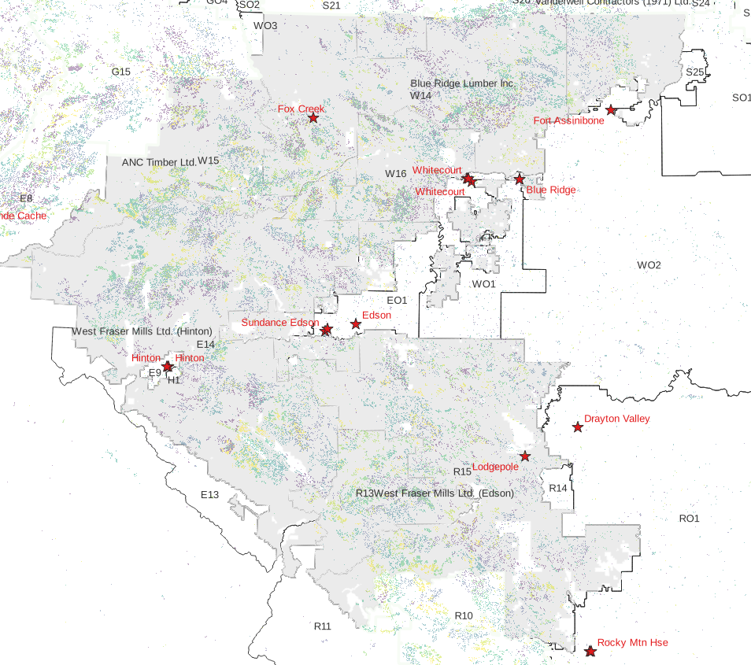
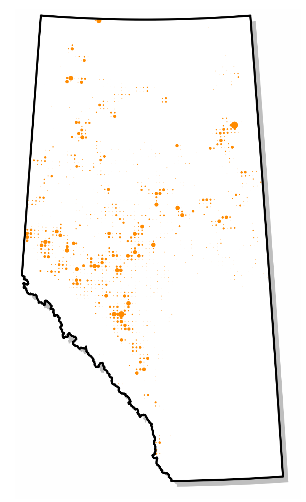
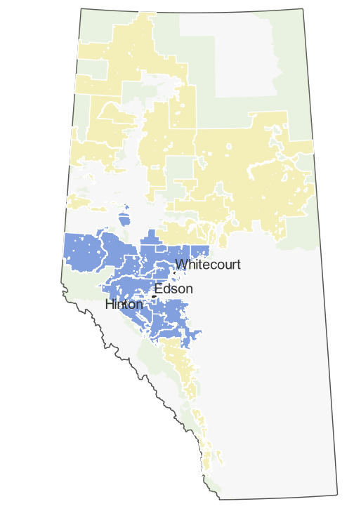
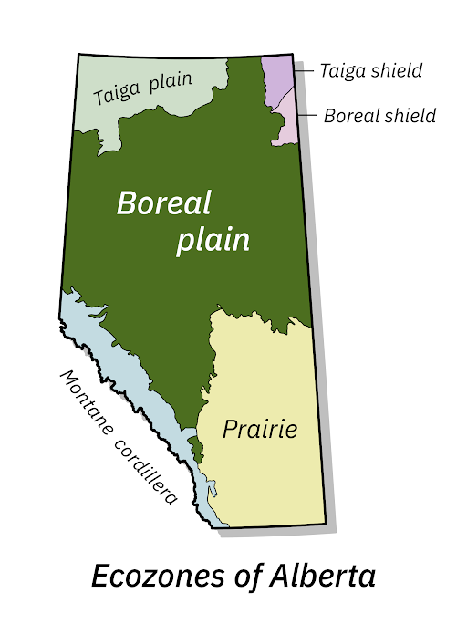

\raggedright


\newpage
\doublespacing

# Introduction

1. **Focus on cost variability associated with transportation and forest  characteristics**
2. **Based on historical harvest locations (1990-2015)**

Need to reference Yemshanov @Yemshanov2014 and Blackburn @Blackburn2020a.  Our
strengths

1. Availability of data
2. Temporal variability
3. suitability for mid-level analysis
4. ultra-cool graphics


## Justification


* renewable fuels better than fossil fuels
* forest harvest residue just piled and burned
* forest road networks in Alberta radiate from location
* terrain is difficult
* simple circle or doughnut models of limited utility
`

# Materials and methods

We describe here our study area, data sources, and method.

## Study area

We use the province of Alberta in western Canada as our study area.
It occupies 661 848 km^2^.  Its southern boundary is 49°N latitude,
northern boundary is 60°N latitude, eastern boundary is 110°W
longitude, and its western boundary is defined by 120°W longitude and
the Great Divide of the Rocky Mountains (Figure 1).

[ Figure 1 about here ]

The southeastern part of the province is largely privately owned
agricultural land, but the northern and western parts are largely
publicly owned forested land.  There is a substantial area of
privately owned agricultural land in the Peace River Country of
northwestern Alberta.  There are also substantial areas in National
Parks along the Rocky Mountains and in the far north of the province.
The province calls the area of mostly publicly owned forested land
(excluding those National Parks) as the Green Area, and the area of
mostly privately owned agricultural land as the White Area.  About 90%
of the harvested timber volume in Alberta comes from the Green Area.

For administrative purposes, the Green Area is divided into Forest
Management Units (FMUs).  The province also enters into long term
agreements with forest products companies giving the companies the
rights to timber harvest and the responsibility to manage the forest
sustainably.  These agreements are called Forest Management
Agreements, and the areas under agreement are called Forest Management
Agreement Areas (FMAAs).  For the most part, the boundaries of the
FMAAs are now coincident with FMU boundaries, with the exception of
the Alberta-Pacific FMAA in eastern Alberta comprises 12 FMUs.  Maps
of the FMUs @AlbertaFMU and the FMAAs @AlbertaFMA can be found on the
Government of Alberta website.  The FMU and FMAA boundaries are
important to this study as they are used to look up average piece size
and utilization standards.  We discuss piece sizes and utilization
standards later. 

Our focus for this study is the forest near Hinton, Edson, and
Whitecourt in west-central Alberta.  These towns were chosen as they
host several forest products companies and are located near several
active FMAAs.  We assume that a residual forest biomass processing
plant would be located near an existing forest products mill as the
forest road network has been developed to supply those mills. Locating
a forest residue processing plant near a forest products mill would
also allow for convenient access to mill residues.

The FMAAs which supply most of the timber to mills  near our
three locations are West Fraser Mills Ltd. (Hinton), West Fraser Mills
Ltd. (Edson), Weyerhaeuser Company Limited (Pembina Timberlands),
Millar Western, Blue Ridge Lumber Inc., and ANC Timber Ltd.

We used the Weyerhaeuser oriented
strand board plant in Edson, the Millar Western Forest Products
Ltd. pulp mill in Whitecourt, and the West Fraser pulp mill in Hinton
as the locations for the hypothetical forest residue processing
facilities.

As well as considering locations for the hypothetical plants, we
considered 3 different plant capacities defined by annual biomass
requirements: 200 Gg/a corresponding to a small wood pellet mill, 400
Gg/a corresponding to a large pellet mill or a small ethanol plant,
and 800 Gg/a corresponding to a large ethanol plant.


## Data sources

We used a number of publicly available datasets to create the
township-level summary data used in our analysis.  Most of the data
are freely available on the World Wide Web (WWW). Much of the data
processing required for this study was manipulation of spatial data.
This was done using the QGIS geographic information system software
@QGISorg2021 and add-ons.  All national level data were clipped to the
Alberta provincial boundary for further analysis.

The datasets are  introduced here.  Their use will be discussed
in detail later. 

### Altalis

Altalis manages much of the spatial data created by or for the
Government of Alberta.  We use several coverages from their base
features database product @Altalis2021: the provincial, Green/White
area, forest management unit (FMU), forest management agreement area
(FMAA), Alberta Township Survey System township, and town boundaries.

The Alberta Township Survey System (ATS) is particularly important to
this study as all the data used for this study are aggregated or
disaggregated to the township level.  ATS provides the basis for legal
land descriptions in Alberta.  The typical township is roughly square
(9.778 km by 9.716 km, 9 500 ha) and is indexed by township (1--126),
range (1--30), and meridian (4--6).  The townships immediately
east of Alberta's western boundary, and immediately east of the 5^th^
and 6^th^ meridians (corresponding to 114°W and 118°W longitude,
respectively) are partial townships and therefore deviate from the
roughly square shape.  ATS is described in detail by the Alberta Land
Surveyor's Association @ALSA2021.  There are 7 237 townships in
Alberta, allowing for spatial resolution appropriate for regional or
provincial level analyses.


### Alberta Geospatial Services

Alberta Geospatial Services is operated by the Alberta Ministry of
Environment and Parks @Alberta2021a.  We obtained road access
coverages from here.  A road access coverage is also available from
Altalis but it does not have as detailed information on road class.

### National Forest Information System


The National Forest Information System (NFIS) provides a set
of spatial data layers representing forest properties at a 250 m
resolution for all of Canada @Beaudoin2017.  We used the merchantable
volume, stand age, and species composition attributes from these
data layers.

Another product of NFIS is a set of spatial datasets derived from
satellite data @NFIS2021b.  The dataset used for this study is the
harvest year data set for the years 1985-2015.  The dataset is
described in detail by Hermosilla *et al.*  @Hermosilla2016.  It
consists of a raster for Canada at 30 m resolution indicating the year
of harvest for each cell.

The NFIS also provides a web-based individual tree biomass calculator
@NFIS2021.  It is used to calculate stem wood, stem bark, branch, and
foliage biomass for a tree based on province, ecozone, species,
diameter at breast height (DBH) and height.  It is possible to upload
a file representing many trees with different combinations of these
input parameters and download a file containing the calculated results
for all the trees.


### Natural Resources Canada

Ung *et al.*  @Ung2013 describe the tree taper models 
developed for Canada.  A valuable contribution related to this is the WWW-based
wood volume calculator that uses those models @NRCan2015.  We use the
taper models developed by Ung *et al.* to calculate merchantable
volumes and the amount of residual biomass available from cutblocks in
each of the townships in each year.


### National Forestry Database

The national forestry database @CCFM2021 was used to summarize the 
timber harvest volume and harvest area from
Alberta for the years 1990-2015. This information is used to adjust the volumes
obtained from the 250 m resolution inventory to better reflect average harvest
volumes observed in Alberta.

### Forest management plans

The Alberta government requires FMA holders to develop a forest management
plan for the FMAA.
The forest management plans were used to get information on utilization 
standards and average piece size of harvested trees for the FMAA @Alberta2021. 


### Agriculture and Agri-Food Canada

The boundaries of Canada's terrestrial ecozones can be found on
Agriculture and Agri-Food Canada's website @Canada2017.  Ecozone is an
input to the individualt tree biomass calculator @NFIS2021.


# Data aggregation and modeling

The GIS analysis for this paper was done using QGIS @QGISorg2021.
Data summaries and statistical analysis were done using R @R2021 with
RStudio @RStudioTeam2021, and tidyverse @Wickham2019.

The primary objective of this paper was to quantify the spatial and
temporal variability of the costs associated with recovering the
residual biomass left on forest cutblocks following timber harvest.  A
driving assumption for this model was that residue recovery is
opportunistic.  Loggers make the decision about what and where to
harvest, and the biomass recovery occurs at some time following timber
harvest.  The decision to harvest is made independently of any
knowledge of the value of residue as biomass.  The biomass gleaners
provide a service to the loggers as the residue would be piled and
burned if it was not recovered as biomass.


Every township will have associated with it a cycle time (and cost)
required to transport harvest residue from the township to each of our
3 plant locations, a measure of residual biomass for each of the 26
years in the study period. For each plant location and year, the model
looks at all the townships in the province that have a positive
residual volume, and begins the creation of cumulative residual
biomass curves starting with the lowest cycle time first.  These lists
of cycle time and cumulative biomass provide the data for the marginal
cycle time and cost curves.

This is a greedy algorithm.  It ignores the cost of moving equipment
from one block to another, but we believe it still provides useful
information.

## Cycle time estimates

The provincial road network was sorted into four classes: primary
highways, other paved roads, two-lane gravel roads, and one-lane
gravel or dirt roads.  Loaded and unloaded travel speeds were assumed
for each road class, according to Table 1. These travel speeds are
based on those assumed by FPInnovations for the Dawson Creek Timber
Supply Area in the neighbouring province of British Columbia
@Blackburn2020.

The harmonic mean of loaded and unloaded speeds was calculated as 
$$
\bar{s_h}=\left(\frac{s_l^{-1} + s_u^{-1}}{2}\right)^{-1} 
$$ 
where $s_l$ is the loaded speed and $s_u$ is the unloaded speed.  Use
of harmonic mean allows us to calculate the correct cycle time: the
time required to travel from the mill, to the collection site at the
cutblock, and back to the mill.  This provides the basis for our
estimates of haul cost.

Figure 3 illustrates the road network in Alberta and estimates of
cycle time based on the average of loaded and unloaded speeds
from Table 1. The road network in the White Area of the province is
very dense and largely arranged as a grid related to the Alberta
Township Survey System.  Most of the roads in the White Area are
public.  The road network in the Green Area is less dense and
many of the roads are built and maintained by resource industries
(*e.g.* forestry and petroleum & natural gas).  The pattern of the
road network is not as regular as in the White Area.

[ Figure 3 about here]

One-way haul times based on the harmonic mean travel speed were
generated using the QGIS Network Analysis Toolbox 3 plug-in (QNEAT3)
created by Raffler @Raffler2018, specifically its iso-area as
interpolation (from point) algorithm.  In our case, we used the
algorithm to determine the minimum one-way travel time (using the
harmonic mean of loaded and unloaded speeds) along the road
network from each of our centres to each cell of a provincial level
raster at a 200 m resolution.  Off-road travel was assumed to be at 5
km/h.  The underlying algorithm for travel time minimization is that
of Dijkstra @Dijkstra1959.  Cycle times were calculated by multiplying
the one-way haul time by 2, and adding 1 hour for loading and unloading


QGIS zonal statistics were used to calculate the median cycle
time to each township, from each of our three centres.  The 
cycle  time in Figure 2 was limited to 14 hours because, in Alberta,
drivers of commercial vehicles are not permitted to drive
more than 13 hours in a 24-hour period, and spend no more that 14
hours on-duty, including loading and unloading times.

[ Figure 2 about here ]


## Biomass collection costs

All costs and prices used in this study are in Canadian dollars (\$).
At the time of writing (2021-11-19 13:49:08 GMT), the exchange rate between
Canadian (CAD) and US dollars (USD) was 0.7914 USD/CAD.

All measures of biomass used in this study are reported in SI units on
a dry matter basis:  1 Mg is equivalent to 1 oven dry metric 
ton.

We assume that the biomass available for collection at a cutblock
includes the tops, branches, and foliage left at a roadside landing
after processing by a stroke delimber.  The delimber is assumed to top
the log at the top diameter specified in the utilization standard
relevant to the harvest area.
Our focus in this study is on the spatial and temporal variation in
biomass collection costs based on residue availability associated with
cycle times.  Following Röser @Roser2013,
<!-- the pre-piling cost was set -->
<!-- to  6.30 \$·Mg^-1^ , the comminution -->
<!-- cost (@Blackburn2020a) was set to 26.82 -->
<!-- \$·Mg^-1^ , and other costs (roads, -->
<!-- supervision, overhead, maintenance, and compliance) were set  -->
<!-- to  8.48 \$·Mg^-1^ .   -->
the cost of recovering residues from a roadside stroke-delimber , excluding
transport, is 41.60 \$·Mg^-1^.

We assume that the residue will be transported from the forest using a
live floor chip van with 100 m^3^ capacity.  The USDA Forest Service's
Forest Residue Transportation Costing Model @Rummer2005 assumes a
default solid volume factor of 0.3 for biomass meaning that a 100 m^3^
capacity trailer could hold the equivalent of 30 m^3^ of solid
biomass.

This equates to 11.40 Mg
of biomass assuming a specific gravity of  0.38 
which is the specific gravity of lodgepole pine wood and bark on a green volume basis 
according to Miles and Smith @Miles2009a.

Timber Tracks produces a publication describing forestry equipment hourly rates
@TT2020.  The rate reported for 
<!-- an 8 axle tridem tractor with a b-train trailer was -->
tandem tractor with a tandem trailer was
157.31 \$/h.  We assume that
the tractor-trailer combination used to haul biomass would cost a 
similar amount.

Therefore, the cost of transporting residual biomass was set to 
13.80 \$·Mg^-1^·h^-1^.


## Harvested area

The areas harvested by township in 2009 according to NFIS @NFIS2021b
@Hermosilla2016 are shown in relationship to the three plant locations and 
the Green Area in Figure 1.  Similar aggregated data were created for
each of the years 1990--2015. For each township, and
each of the years between 1990 and 2015, we store the area harvested (ha) for
use in our analysis.  We can see from this map that a great deal of timber
harvest took place near our hypothetical plant locations in 2009.

These data were created by using QGIS zonal statistics to sum the area
harvested in each township in each year based on the 30 m resolution
harvest data @NFIS2021b. 


## Utilization standards

Many forest products companies operate in Alberta, and the details of
their agreements with the government with respect to forest management
differ.  Some companies have harvesting rights to just the needleleaf
species, others have rights to just the broadleaf species, and some
have rights to both needleleaf and broadleaf.

Utilization standards in Alberta are specified on the basis of stump
height, minimum stump diameter (outside bark), and minimum log length
to a specified top diameter (inside bark).  Utilization standards vary
by FMU.  Stump heights used in Alberta are 15 and 30 cm; stump
diameters are 13 or 15 cm; top diameters range between 7 and 12 cm;
and minimum log lengths range between 2.44 and 4.88 m.  These
utilization standards are necessary to relate volumes calculated to
the 13+/7 cm standard for the National Forest Inventory to the harvest
volumes reported by the companies.  Perhaps most importantly, the
minimum top diameter will have an effect on the volume of residue left
in the forest corresponding to the tops of trees.

Based on the FMU boundaries, we assign a needleleaf and broadleaf
utilization standard to each township.


## Characteristics of the "average" tree

### Piece size

FMA holders are  required by Alberta to project average piece size in the 
detailed forest management plans (DMFPs) for their FMAAs.  We use these piece sizes
projected for the first period of the DMFP.  They range from 0.110 to 0.599 m^3^
per tree.
We used the piece size reported
for the first 5-year period of the 200-year planning horizon.  For
those areas where piece size was not reported we assumed an average
piece size of 0.278 m^3^ for needleleaf trees and 0.264 m^3^ for
broadleaf trees.  These are the average of the values reported in
the forest management plans.  These values are based on the
utilization standards used on the FMA.  Based on the FMU boundaries we
assign an average piece size for broadleaf and needleleaf trees to
each township.


### Taper functions

Ung *et al.* @Ung2013 present taper models and the associated
coefficients for the tree species found in Canada.  These taper models
can be used to find the diameter at any point along the main bole of a
tree given species and diameter at breast height (DBH).  DBH is a
commonly used tree measurement and is the diameter of the tree
measured at 1.3 m above ground level, in most jurisdictions, including
Alberta.  It is straightforward to determine cross-sectional area of
the tree at any height.  Integrating this area function will yield
volume between any two heights.

They present a one-parameter model which is useful when both tree DBH
and height measurements are available. 
$$
d(d_b,h) = \left(d^2_{b} \frac{H-h}{H - 1.3} \left(\frac{h}{1.3}\right)^{2-\beta_2}\right)^{-2}
$$
where $d$ is the diameter (cm) at height $h$ (m), and $d_b$ is the diameter at
breast height (1.3 m above ground level), and $H$ is tree height (m).

For those cases where height measurements are unavailable, they
present a 3-parameter model, where H is replaced with $\beta_0 d_{b}^{\beta_1}$. 

$$
d(d_b,h) = \left(d^2_{b} \frac{\beta_0 d_{b}^{\beta_1}}{\beta_0 d_{b}^{\beta_1} - 1.3} \left(\frac{h}{1.3}\right)^{2-\beta_2}\right)^{-2}
$$

where $d$ is the diameter (cm) at height $h$ (m), and $d_b$ is the diameter at
breast height (1.3 m above ground level)

Implicit in this equation is an equation for tree height
$$
H(d_b) = \beta_0 d_b ^ {\beta_1}
$$
which we will use to create input for the biomass calculator

The radius of the tree (m) can be calculated from $d_b$ and $h$ using
$$
r(d_b,h) = \frac{d(d_b,h)}{200}
$$
where the constant 200 is used to convert a diameter (cm) to a radius (m). 
$$
a(d_b,h) = \pi r(d_b,h)^2
$$

The volume of the merchantable log between stump height $h_s$ and the
height of the tree at the minimum top diameter ($h_t$) can then be
calculated through integration.
$$
v(d_b,h_s,h_t) = \int_{h_s}^{h_t} \pi r(d_b,h)^2 dh
$$

Ung *et al.* also present a simple linear model relating outside bark
to inside bark diameter.  The taper function is for outside bark
diameter, but piece sizes are reported as inside bark volume.

### DBH and height estimates

From information collected from forest management plans we have an
estimate of average piece size calculated to a specified utilization
standard for every combination of township and FMU, for both needleaf
and broadleaf trees.  We used a binary search procedure to find DBH
and height of the "average" broadleaf and needleleaf tree in each
township based on the FMP utilization standard.  An average piece
size to the 13+/7 utilization standard was also calculated by
integrating the cross-sectional area function using the appropriate limits.

Most forest stands in Alberta are considered to be even-aged, as the majority 
originated following stand-replacing fire or clearcut harvest.  It is common to describe
stands using a distribution of diameters at breast height (DBH).  The
diameter distribution for an even-aged stand is usually approximately normal 
@Bettinger2017.  We use this to justify  the use of the average tree.

Using these equations, we are able to calculate wood volumes and bark volumes
between any two heights along the tree stem.  We calculate the proportions 
of total tree and bark volumes in the top of the tree.  We use this volume 
proportion later to calculate biomass of stemwood and bark in the top.


The merchantable volume for the average tree is calculated to both the 13+/7 cm 
utilization standard and the utilization standard specified for the FMU.  The 13+/7
utilization standard is used to calculate the stand density (stems/ha) for both
the needleleaf and the broadleaf species.  The FMU utilization standard is use to calculate
the volume adjustment factor.

<!-- The number of harvested stems per ha is calculated by dividing the 13+/7 volume -->
<!-- per ha by the 13+/7 piece size. -->


### Individual tree resdual biomass.

Canada's national forest inventory website provides a useful individual
tree biomass calculator @NFIS2016.  It calculates the biomass of tree 
components (stem wood, stem bark, branches, foliage, and total) using
province/territory, terrestrial ecozone, species, DBH, and tree height as input.
It is possible to upload a file to the calculator so that the biomass of
many trees can be calculated at once.  The calculator is based on work
by Lambert *et al.* @Lambert2005.

We created an input file for the NFIS biomass calculator that included
all 125 unique combinations of species, ecozone, DBH, and height
assigned to the townships in the previous sub-sub-section (**Create cross-references**).

We assume that the residual biomass is in the stem wood and stem bark from the
tops of the harvested trees and the branches and foliage.  The residual biomass
from the tops is calculated using the total biomass of stem wood and stem bark
adjusted by the volume proportions calculated above.


## Spatial variability in residual biomass production

There is considerable spatial variability in the amount of timber
harvest residues available for biomass collection.  The variability
relates to the distribution of harvested species and age classes
across the landscape, to the timber harvesting practices of different
operators, and to other factors.  We used the 250 m resolution raster
maps of Canada's forest attributes for 2011 from Natural Resources
Canada @Beaudoin2017 to retrieve information on species composition,
age classes, and merchantable volume.  The data were clipped to the
Alberta boundary.  Merchantable volumes for Alberta in this dataset
were compiled to the 13+/7 cm utilization standard, meaning that stump
height for each merchantable tree was assumed to be 30 cm, that stump
diameter (outside bark) was at least 13 cm, and that the length of the
log to a 7 cm inside bark diameter was at least 4.88 m.  This is one
of the utilization standards used in Alberta and was the one used for
Alberta data in Canada's National Forest Inventory (NFI henceforth)
@Boudewyn2007.

Forestry companies are selective in the stands they harvest.  Some
stands will be comprised of undesirable species.  The most
commercially important needleleaf species in Alberta are white spruce
(*Picea glauca* (Moench) Voss), lodgepole pine (*Pinus contorta*
var. *latifolia* Engelm.) and jack pine (*Pinus banksiana* Lamb.).
Trembling aspen (*Populus tremuloides* Michx.) is the most
commercially important broadleaf species.  Some stands may have too
little volume to be worth harvesting.  Some stands may be too young.
We selected cells that contained at least 50 m^3^·ha^-1^ of merchantable
volume, as that corresponds with merchantability limits specified in
Alberta @Alberta2016. We filtered out cells with more than 50% crown
closure of larch (*Larix spp.* Mill.) and birch (*Betula spp.* L.)
combined as those genera are rarely harvested at a commercial scale in
Alberta.  We filtered out cells with stand age less than 80 years as
it is unusual to harvest stands younger than that in Alberta. QGIS
zonal statistics were used to average the merchantable volume per ha
of the merchantable cells in each township.

Then for each township, we determined the most common needleleaf and
broadleaf species, and calculated the average volume per hectare of
needleleaf and broadleaf these harvestable stands.

These average volumes are still considerably less than the average
volume per hectare harvested in Alberta, indicating that the forestry
companies are even more selective about timber harvest than our simple
filter rules suggest.

Based on data retrieved from the National Forestry Database, the
average harvest volume in Alberta between 1990 and 2015 was 277.8
m^3^·ha^-1^ @CCFM2020.  The average township volume after the filter
was applied was 100.3 m^3^·ha^-1^. We used a harvest volume adjustment
factor of  2.77 to make the volumes we
calculated comparable to the average harvest volume (m^3^·ha^-1^) for Alberta.


<!-- **A little more explanation is needed..** -->

<!-- Something about needleleaf and broadleaf trees.  Most common species -->
<!-- harvested are white spruce (*Picea glauca* (Moench) Voss), lodgepole -->
<!-- pine (*Pinus contorta* var. *latifolia* Engelm.), jack pine (*Pinus -->
<!-- banksiana* Lamb.), trembling aspen (*Populus tremuloides* Michx.), and -->
<!-- less commonly black spruce (*Picea mariana* (Mill.) Britton, Sterns & -->
<!-- Poggenburg), Engelmann spruce (*Picea engelmannii* Parry ex Engelm.), -->
<!-- balsam poplar (*Populus balsamifera* L.), balsam fir (*Abies balsamea* -->
<!-- (L.) Mill.), subalpine fir (*Abies lasiocarpa* (Hooker) Nuttall), and -->
<!-- Rocky Mountain Douglas-fir (*Pseudotsuga menziesii* var. *glauca* -->
<!-- (Mayr) Franco). -->


<!-- ## Hypothetical plant locations and capacities -->
<!-- Location stuff based on Onyango @Onyango2019. -->

<!-- There are a number of companies with Forest Management Agreement Areas -->
<!-- located near Edson, Whitecourt, and Hinton. -->
<!-- The West Fraser Mills Ltd. (Hinton) FMAA is the primary timbershed for the -->
<!-- Hinton Wood Products sawmill and the Hinton Pulp pulp mill.  The West Fraser Mills Ltd. (Hinton) FMA is the primary timbershed for the Edson Forest Products  -->
<!-- sawmill.  The Weyerhaeuser Company Limited (Pembina Timberlands) FMAA supplies  -->
<!-- the Edson oriented strand board mill and the Drayton Valley sawmill.  The  -->
<!-- Weyerhaeuser Company Limited (Pembina Timberlands) FMAA supplies sawmills in Whitecourt and Fox Creek, a pulp mill -->
<!-- in Whitecourt, and a specialty wood products facility and Acheson.  The Blue -->
<!-- Ridge Lumber Inc. FMAA supplies a sawmill in Blue Ridge, which is about 23 km  -->
<!-- from Whitecourt.  The ANC Timber Ltd. FMAA supplies logs to several sawmills in -->
<!-- the area, in exchange for chips used to feed the Alberta Newsprint -->
<!-- Company newsprint mill in Whitecourt. -->

<!-- ```{r west_central_ab, echo=FALSE, fig.cap="Location of Forest Management Agreement Areas serving Hinton, Edson, and Whitecourt.", out.width = '80%'} -->
<!--  -->
<!-- ``` -->


<!-- ### Terrestrial ecozone map -->

<!-- Most -->
<!-- of the timber harvest in Alberta occurs in the Boreal Plain, but some occurs -->
<!-- in the Montane Cordillera and Taiga Plain. -->


<!-- The NFIS' individual tree biomass calculator @NFIS2016 uses province, ecozone,  -->
<!-- species, DBH, and height as input variables, so ecozone is important.  It is based on  -->
<!-- equations developed by Lambert -->
<!-- *et al.* (2005) @Lambert2005. -->


<!-- This is a second best analysis.  Detailed information on harvest -->
<!-- volumes tied to spatial location is held by the provincial government -->
<!-- as scale records.  Real (as opposed to modelled) forest inventory -->
<!-- information is collected by holders of forest management agreements as -->
<!-- Alberta Vegetation Inventory.  Despite the fact that forest harvesting -->
<!-- occurs mostly on public land, the government considers this -->
<!-- information to be the property of companies, and requires the consent -->
<!-- of companies to release it to researchers.  There are currently 21 -->
<!-- Forest Management Agreements in Alberta.  Permission would need to be -->
<!-- obtained from the holders of each of those FMAs as well as smaller -->
<!-- companies that operate sawmills. -->


## Residue yield by township.

For each township, we calculate the number of stems by dividing the
adjusted volume per hectare by the average piece size for both
needleleaf and broadleaf trees.  We assume that for the types of
stands being harvested that the stem count per hectre for the 13/+7
utilization standard is close to the stem count based on the FMU
utilization standard.  We multiply the stem count by the average tree
residual biomass. We assume an average recovery factor of 0.624
following what Peltola *et al.*  @Peltola2011 determined for Finland,
recognizing that some of the residual biomass will be unrecoverable.
Together this gives us an estimate of the average residue yield when a
hectare of a stand in a particular township is harvested.

## The model

The bulk of the effort expended on this study was spent in creating
township-level summaries for use by the model.  The model itself is
very simple.  We assume that the residue collectors follow a kind of
greedy optimization.  They take the cheapest residue first, and stop
when they have enough residue to satisfy annual plant
requirements. For each combination of plant location and year, all the
townships in Alberta were sorted by ascending cycle time (equivalently
tranport cost).  The model works through this list, cumulating harvest
residue recovered from the harvest area associated for the township
and year, and provided a file showing cycle time, total cost, and
cumulative residue recoverd.  Once this file is created, fairly simple
data manipulations are undertaken to produce the results.

As with all models, this is a simplification.  One avenue that we
would like to explore in future work is incorporation of the costs of
moving equipment from one cutblock to the next.


<!-- ```{r harvbyowner, echo=FALSE, fig.cap="NFDP harvest levels by ownership.", out.width = '100%'} -->
<!-- knitr::include_graphics("../img/harvestbyowner.png") -->
<!-- ``` -->


# Results and discussion

## The volume adjustment factor

The volume adjustment factor that we described in section **blah
blah** may be the most arbitrary assumption we made.  Figure **blah
blah** shows the actual harvest volume for Alberta between 1990 and
2015 using data from the national forestry database @CCFM2021.  The
largest discrepancy occurs in 1998 where the estimated volume is
substantially larger than the actual volume. Note that in 1998,
industrial salvage volumes of 369 791 m^3^ of softwood and 264 647
m^3^ are not included in the harvest levels shown in the graph.

[ Figure blah blah about here ]

The estimated harvest volume was calculated using the harvest areas
identified in the 30 m data, and the adjusted harvest volume per
hectare determined for each township.  We are satisfied that, at the
provincial level, the adjustment factor produces estimates of harvest
volume similar to that recorded in the national forestry database, and
is appropriate for use for this study.

The left panel of Figure 2 shows the spatial distribution of
merchantable volume by township.  The region near to the assumed plant
locations is a region of high volume per hectare. The right panel
shows the calculated merchantable volume per hectare for harvested
area in each of the townships.

## Distributional results


Figures 9 and 10 display marginal cycle time (h) and marginal costs
($·Mg^-1^) for each of the 26 years in the study period, and for the 3
alternative plant locations.  Curves for 1990, 2009, and 2005 are
highlighted represented the years of minimum, median, and maximum
provincial harvest volume in the period.  The inter-year variation in
marginal costs increases as the cumulative amount of residue collected
increases.  We can also see that the relative position of the years in
terms of cost varies between the plant locations: *e.g.* the year 2005
is not as good for Hinton, as it was for Edson and Whitecourt.

[ Figure 9 about here]

[ Figure 10 about here]

Figure 11 is another way of presenting the year to year variation in
the distribution of costs between the plant locations and assumed
capacity: the boxplots display the quartiles and the minimum and
maximum costs require to supply a plant of a given capacity at each of
the locations in each of the years.  Here again, we can see the
variability increasing as plant capacity increases.

[Figure 11 about here ]

Figure 12 shows the average cost ($·Mg^-1^) for each location,
capacity, and year.  Overall, the average costs in Edson and
Whitecourt are quite similar.  Hinton is usually more expensive across
years and capacities.  The differences become clearer at a capacity of
800 Gg, where Whitecourt is the low cost location for most of the
years.

[Figure 12 about here ]

Table 2 presents summary statistics over the 26 year for the locations
and capacities.  It is clear that average costs and the inter-annual
variability of costs increase with increasing capacity.  It is clear
that the variation is costs for Hinton is greater than for Whitecourt
and Edson, particularly for the 800 Gg/a capacities.

[ Table 2 about here ]

Figure 13 shows the areas that would have been needed to supply a
plants of varying capacities in Whitecourt in the year of median
harvest (2009) in relation to the proportional township area
harvested.  There is some residue being collected from the White area,
but most of it is being collected from the green area.

[ Figure 13 about here ]

Figure 14 compares the supply areas for 2005, 2009, and 1990 (high,
median, and low harvest years) for Whitecourt.  The area required to
supply the mills increases by a lot in low timber harvest years,
particularly for the 800 Gg/a capacity.  Similar maps have produced
for the other locations and all 26 years and are available at the
University of Alberta's Education and Research Archive (ERA).
**cite**  Notice that the supply areas include areas outside the Green
Area with very little harvest.  The contours indicate the travel time
associated with each of the capacities.  Because of the cost of
moving equipment such as the grinder and loader, it is unlikely that
the small, dispersed cut area would be accessed, but the volumes are
small enough that we will ignore them.

[ Figure 14 about here ]

Whitecourt is low cost for most years at all capacities.  Noticable spike in
1999.  Probably due to Virginia Hills fire salvage.  Note that this spike
also affects Hinton and Edson at 800 Gg/a  capacity, 
because they reach into the 
Whitecourt area.

As expected, residue costs are lower with lower capacities because
they don't have to reach so far out.

Overall, the results show that there is a high level of interannual
variability in the costs of retrieving a fixed amount of 
biomass from timber harvesting residues.  In our case, the variability
is related to the area and location of harvest and is tied directly to
transportation costs.

# Conclusions

We have developed a simple model that demonstrates the spatial and
temporal variation in the availablity of timber harvest residue for
biomass energy production.  We did this using the location of timber
harvest areas in the Canadian province of Alberta for the years
1990--2015.  This is a historical study, but the information generated
could be useful for investors exploring the potential of forest
residues in Alberta for biomass energy production.

We examined three potential plant locations, and three alternative
plant capacities as measured by biomass input requirements:  200 Gg/a,
400 Gg/a, and 800 Gg/a.

The results showed considerable variability in residue collection
costs from year to year.  The variability increases as input
requirements increase.

For the 200 Gg/a capacity the three locations are almost
indistinguishable in terms of mean cost (~ 87 \$ Mg^-1^).
At 400 Gg/a, Edson is the low cost location (98.6 \$ Mg^-1^).
At 800 Gg/a, Whitecourt is clearly the low cost location (122 \$
Mg^-1^).  The average cost of supplying a 800 Gg/a plant is at least
40% greater than supplying a 200 Gg/a plant.
 
Perhaps it makes sense to transport to smaller plants (e.g. pellets), and
then aggregate at a larger plant (e.g. ethanol).  Pellets are cheaper to 
transport than comminuted biomass.

# Data availability {-}

The data compiled to the township level are currently available on
github(https://github.com/gwa-uab/histressup/tree/main/data).  Before
publication it will be placed on ERA with a DOI.


# Acknowledgements {-}

This research was supported by funding from the Canada First Research Excellence
Fund as part of the University of Alberta’s Future Energy Systems 
research initiative (Project # CFREF-2015-00001).

Dennis Gray contributed to data compilation.

This work started as an extension to Irene Onyango's Master of Agriculture
research.

We work with a group of talented people.  Thanks to Marty Luckert, Feng Qiu,
Grant Hauer, and Wenbei Zhang for helpful discussion.

\newpage

# Reference list  {-}

<div id="refs"></div>

\newpage

# Tables {-}


Table 1:  Road speeds based on FPInnovations (km/h).

| Road class      | loaded | unloaded | harmonic mean | 
|:----------------|-------:|---------:|--------------:|
| primary highways|    85  |       95 |           90  |
| other paved     |    77  |       86 |           81  |
| 2-lane gravel   |    60  |       67 |           63  | 
| 1-lane gravel or dirt  |    29  |       25 |           27  | 
| no road           |     5  |       5  |           5   |

Table 2:  Summary statistics.

<!--html_preserve--><div id="lifsetqbdt" style="overflow-x:auto;overflow-y:auto;width:auto;height:auto;">
<style>html {
  font-family: -apple-system, BlinkMacSystemFont, 'Segoe UI', Roboto, Oxygen, Ubuntu, Cantarell, 'Helvetica Neue', 'Fira Sans', 'Droid Sans', Arial, sans-serif;
}

#lifsetqbdt .gt_table {
  display: table;
  border-collapse: collapse;
  margin-left: auto;
  margin-right: auto;
  color: #333333;
  font-size: 16px;
  font-weight: normal;
  font-style: normal;
  background-color: #FFFFFF;
  width: auto;
  border-top-style: solid;
  border-top-width: 2px;
  border-top-color: #A8A8A8;
  border-right-style: none;
  border-right-width: 2px;
  border-right-color: #D3D3D3;
  border-bottom-style: solid;
  border-bottom-width: 2px;
  border-bottom-color: #A8A8A8;
  border-left-style: none;
  border-left-width: 2px;
  border-left-color: #D3D3D3;
}

#lifsetqbdt .gt_heading {
  background-color: #FFFFFF;
  text-align: center;
  border-bottom-color: #FFFFFF;
  border-left-style: none;
  border-left-width: 1px;
  border-left-color: #D3D3D3;
  border-right-style: none;
  border-right-width: 1px;
  border-right-color: #D3D3D3;
}

#lifsetqbdt .gt_title {
  color: #333333;
  font-size: 125%;
  font-weight: initial;
  padding-top: 4px;
  padding-bottom: 4px;
  border-bottom-color: #FFFFFF;
  border-bottom-width: 0;
}

#lifsetqbdt .gt_subtitle {
  color: #333333;
  font-size: 85%;
  font-weight: initial;
  padding-top: 0;
  padding-bottom: 6px;
  border-top-color: #FFFFFF;
  border-top-width: 0;
}

#lifsetqbdt .gt_bottom_border {
  border-bottom-style: solid;
  border-bottom-width: 2px;
  border-bottom-color: #D3D3D3;
}

#lifsetqbdt .gt_col_headings {
  border-top-style: solid;
  border-top-width: 2px;
  border-top-color: #D3D3D3;
  border-bottom-style: solid;
  border-bottom-width: 2px;
  border-bottom-color: #D3D3D3;
  border-left-style: none;
  border-left-width: 1px;
  border-left-color: #D3D3D3;
  border-right-style: none;
  border-right-width: 1px;
  border-right-color: #D3D3D3;
}

#lifsetqbdt .gt_col_heading {
  color: #333333;
  background-color: #FFFFFF;
  font-size: 100%;
  font-weight: normal;
  text-transform: inherit;
  border-left-style: none;
  border-left-width: 1px;
  border-left-color: #D3D3D3;
  border-right-style: none;
  border-right-width: 1px;
  border-right-color: #D3D3D3;
  vertical-align: bottom;
  padding-top: 5px;
  padding-bottom: 6px;
  padding-left: 5px;
  padding-right: 5px;
  overflow-x: hidden;
}

#lifsetqbdt .gt_column_spanner_outer {
  color: #333333;
  background-color: #FFFFFF;
  font-size: 100%;
  font-weight: normal;
  text-transform: inherit;
  padding-top: 0;
  padding-bottom: 0;
  padding-left: 4px;
  padding-right: 4px;
}

#lifsetqbdt .gt_column_spanner_outer:first-child {
  padding-left: 0;
}

#lifsetqbdt .gt_column_spanner_outer:last-child {
  padding-right: 0;
}

#lifsetqbdt .gt_column_spanner {
  border-bottom-style: solid;
  border-bottom-width: 2px;
  border-bottom-color: #D3D3D3;
  vertical-align: bottom;
  padding-top: 5px;
  padding-bottom: 5px;
  overflow-x: hidden;
  display: inline-block;
  width: 100%;
}

#lifsetqbdt .gt_group_heading {
  padding: 8px;
  color: #333333;
  background-color: #FFFFFF;
  font-size: 100%;
  font-weight: initial;
  text-transform: inherit;
  border-top-style: solid;
  border-top-width: 2px;
  border-top-color: #D3D3D3;
  border-bottom-style: solid;
  border-bottom-width: 2px;
  border-bottom-color: #D3D3D3;
  border-left-style: none;
  border-left-width: 1px;
  border-left-color: #D3D3D3;
  border-right-style: none;
  border-right-width: 1px;
  border-right-color: #D3D3D3;
  vertical-align: middle;
}

#lifsetqbdt .gt_empty_group_heading {
  padding: 0.5px;
  color: #333333;
  background-color: #FFFFFF;
  font-size: 100%;
  font-weight: initial;
  border-top-style: solid;
  border-top-width: 2px;
  border-top-color: #D3D3D3;
  border-bottom-style: solid;
  border-bottom-width: 2px;
  border-bottom-color: #D3D3D3;
  vertical-align: middle;
}

#lifsetqbdt .gt_from_md > :first-child {
  margin-top: 0;
}

#lifsetqbdt .gt_from_md > :last-child {
  margin-bottom: 0;
}

#lifsetqbdt .gt_row {
  padding-top: 8px;
  padding-bottom: 8px;
  padding-left: 5px;
  padding-right: 5px;
  margin: 10px;
  border-top-style: solid;
  border-top-width: 1px;
  border-top-color: #D3D3D3;
  border-left-style: none;
  border-left-width: 1px;
  border-left-color: #D3D3D3;
  border-right-style: none;
  border-right-width: 1px;
  border-right-color: #D3D3D3;
  vertical-align: middle;
  overflow-x: hidden;
}

#lifsetqbdt .gt_stub {
  color: #333333;
  background-color: #FFFFFF;
  font-size: 100%;
  font-weight: initial;
  text-transform: inherit;
  border-right-style: solid;
  border-right-width: 2px;
  border-right-color: #D3D3D3;
  padding-left: 12px;
}

#lifsetqbdt .gt_summary_row {
  color: #333333;
  background-color: #FFFFFF;
  text-transform: inherit;
  padding-top: 8px;
  padding-bottom: 8px;
  padding-left: 5px;
  padding-right: 5px;
}

#lifsetqbdt .gt_first_summary_row {
  padding-top: 8px;
  padding-bottom: 8px;
  padding-left: 5px;
  padding-right: 5px;
  border-top-style: solid;
  border-top-width: 2px;
  border-top-color: #D3D3D3;
}

#lifsetqbdt .gt_grand_summary_row {
  color: #333333;
  background-color: #FFFFFF;
  text-transform: inherit;
  padding-top: 8px;
  padding-bottom: 8px;
  padding-left: 5px;
  padding-right: 5px;
}

#lifsetqbdt .gt_first_grand_summary_row {
  padding-top: 8px;
  padding-bottom: 8px;
  padding-left: 5px;
  padding-right: 5px;
  border-top-style: double;
  border-top-width: 6px;
  border-top-color: #D3D3D3;
}

#lifsetqbdt .gt_striped {
  background-color: rgba(128, 128, 128, 0.05);
}

#lifsetqbdt .gt_table_body {
  border-top-style: solid;
  border-top-width: 2px;
  border-top-color: #D3D3D3;
  border-bottom-style: solid;
  border-bottom-width: 2px;
  border-bottom-color: #D3D3D3;
}

#lifsetqbdt .gt_footnotes {
  color: #333333;
  background-color: #FFFFFF;
  border-bottom-style: none;
  border-bottom-width: 2px;
  border-bottom-color: #D3D3D3;
  border-left-style: none;
  border-left-width: 2px;
  border-left-color: #D3D3D3;
  border-right-style: none;
  border-right-width: 2px;
  border-right-color: #D3D3D3;
}

#lifsetqbdt .gt_footnote {
  margin: 0px;
  font-size: 90%;
  padding: 4px;
}

#lifsetqbdt .gt_sourcenotes {
  color: #333333;
  background-color: #FFFFFF;
  border-bottom-style: none;
  border-bottom-width: 2px;
  border-bottom-color: #D3D3D3;
  border-left-style: none;
  border-left-width: 2px;
  border-left-color: #D3D3D3;
  border-right-style: none;
  border-right-width: 2px;
  border-right-color: #D3D3D3;
}

#lifsetqbdt .gt_sourcenote {
  font-size: 90%;
  padding: 4px;
}

#lifsetqbdt .gt_left {
  text-align: left;
}

#lifsetqbdt .gt_center {
  text-align: center;
}

#lifsetqbdt .gt_right {
  text-align: right;
  font-variant-numeric: tabular-nums;
}

#lifsetqbdt .gt_font_normal {
  font-weight: normal;
}

#lifsetqbdt .gt_font_bold {
  font-weight: bold;
}

#lifsetqbdt .gt_font_italic {
  font-style: italic;
}

#lifsetqbdt .gt_super {
  font-size: 65%;
}

#lifsetqbdt .gt_footnote_marks {
  font-style: italic;
  font-weight: normal;
  font-size: 65%;
}
</style>
<table class="gt_table">
  <thead class="gt_header">
    <tr>
      <th colspan="4" class="gt_heading gt_title gt_font_normal gt_bottom_border" style>summary stats</th>
    </tr>
    
  </thead>
  <thead class="gt_col_headings">
    <tr>
      <th class="gt_col_heading gt_columns_bottom_border gt_right" rowspan="1" colspan="1">Capacity (Gg/a)</th>
      <th class="gt_col_heading gt_columns_bottom_border gt_right" rowspan="1" colspan="1">Mean ($/Mg</th>
      <th class="gt_col_heading gt_columns_bottom_border gt_right" rowspan="1" colspan="1">Std. Dev. ($/Mg)</th>
      <th class="gt_col_heading gt_columns_bottom_border gt_right" rowspan="1" colspan="1">C.V.</th>
    </tr>
  </thead>
  <tbody class="gt_table_body">
    <tr class="gt_group_heading_row">
      <td colspan="4" class="gt_group_heading">Edson</td>
    </tr>
    <tr><td class="gt_row gt_right">200</td>
<td class="gt_row gt_right">87.0</td>
<td class="gt_row gt_right">4.42</td>
<td class="gt_row gt_right">0.0508</td></tr>
    <tr><td class="gt_row gt_right">400</td>
<td class="gt_row gt_right">98.6</td>
<td class="gt_row gt_right">5.94</td>
<td class="gt_row gt_right">0.0603</td></tr>
    <tr><td class="gt_row gt_right">800</td>
<td class="gt_row gt_right">128</td>
<td class="gt_row gt_right">14.0</td>
<td class="gt_row gt_right">0.109</td></tr>
    <tr class="gt_group_heading_row">
      <td colspan="4" class="gt_group_heading">Hinton</td>
    </tr>
    <tr><td class="gt_row gt_right">200</td>
<td class="gt_row gt_right">87.5</td>
<td class="gt_row gt_right">7.08</td>
<td class="gt_row gt_right">0.0809</td></tr>
    <tr><td class="gt_row gt_right">400</td>
<td class="gt_row gt_right">105</td>
<td class="gt_row gt_right">8.44</td>
<td class="gt_row gt_right">0.0804</td></tr>
    <tr><td class="gt_row gt_right">800</td>
<td class="gt_row gt_right">138</td>
<td class="gt_row gt_right">15.7</td>
<td class="gt_row gt_right">0.113</td></tr>
    <tr class="gt_group_heading_row">
      <td colspan="4" class="gt_group_heading">Whitecourt</td>
    </tr>
    <tr><td class="gt_row gt_right">200</td>
<td class="gt_row gt_right">87.6</td>
<td class="gt_row gt_right">3.82</td>
<td class="gt_row gt_right">0.0436</td></tr>
    <tr><td class="gt_row gt_right">400</td>
<td class="gt_row gt_right">101</td>
<td class="gt_row gt_right">5.41</td>
<td class="gt_row gt_right">0.0537</td></tr>
    <tr><td class="gt_row gt_right">800</td>
<td class="gt_row gt_right">122</td>
<td class="gt_row gt_right">9.88</td>
<td class="gt_row gt_right">0.0809</td></tr>
  </tbody>
  
  
</table>
</div><!--/html_preserve-->

\newpage


# Figures {-}





\newpage
\blandscape

\elandscape

\newpage
\blandscape

\elandscape

<!-- ```{r studyarea, echo=FALSE, fig.cap="Location of hypothetical residue processing plants in relation to FMAA boundaries and the Green and White Areas of Alberta.", out.width = '80%'} -->
<!--  -->
<!-- ``` -->


<!-- ```{r ecozones, echo=FALSE, fig.cap="Terrestrial ecozones of Canada within Alberta.", out.width = '80%'} -->
<!--  -->
<!-- ``` -->

\newpage
\blandscape

\elandscape

<!-- ```{r residue, echo=FALSE, fig.cap="Biomass residue available from harvest.", out.width = '100%'} -->
<!-- knitr::include_graphics("../img/residue.png") -->
<!-- ``` -->


\newpage
\blandscape

\elandscape


\newpage
\blandscape

\elandscape

\newpage
\blandscape

\elandscape

\newpage
\blandscape

\elandscape


\newpage
\blandscape

\elandscape
