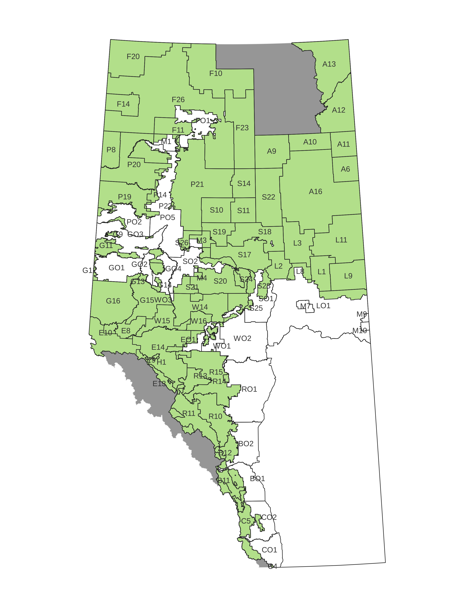
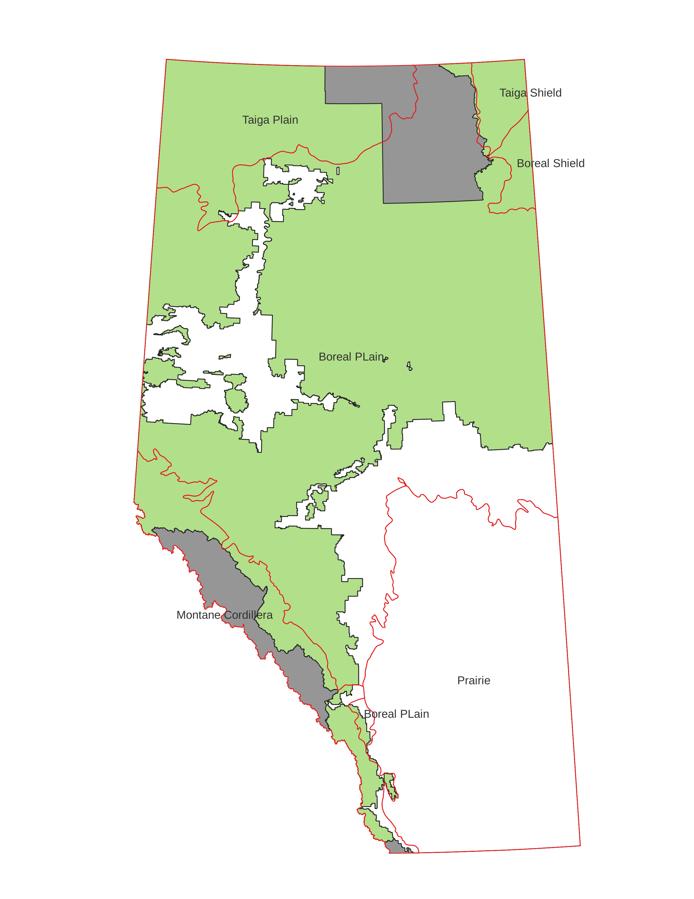
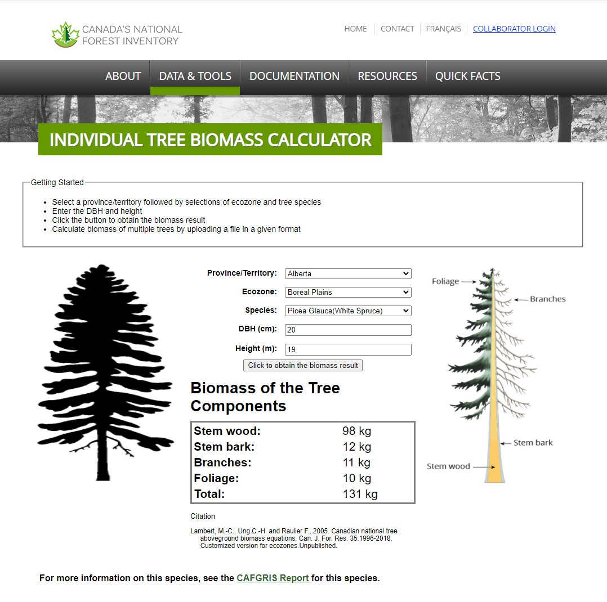
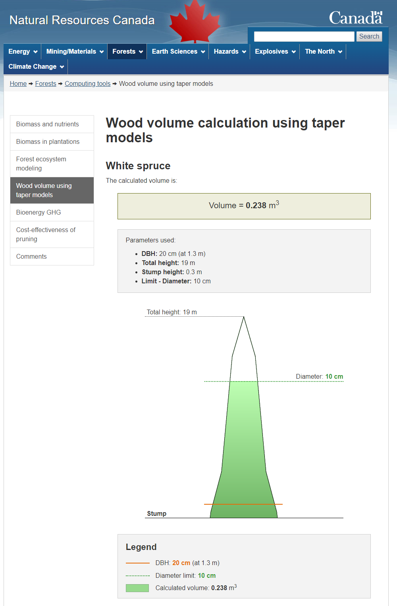

<!-- \fontfamily{cmr} -->
<!-- \fontsize{12}{22} -->
<!-- \fontseries{b} -->
<!-- \selectfont -->

```{r setup, include=FALSE, echo = FALSE, message=FALSE}
knitr::opts_chunk$set(echo = TRUE)
```

```{r libraries, echo=FALSE, message=FALSE}
setwd("g:/Shared drives/FES_Data_Sharing_Forestry/Manuscripts/histressupp")
#setwd("/mnt/chromeos/GoogleDrive/SharedDrives/FES_Data_Sharing_Forestry/Manuscripts/histressupp/analysis")
library(tidyverse)
library(ggthemes)
library(gridExtra)
library(viridis)
library(skimr)
library(scales)
library(DescTools)
library(zoo)
library(ezknitr)
#ezknit(file="analysis/manuscript.Rmd", out_dir="output", fig_dir="myfigs")
```

# Introduction

Here's something that might help our writing.  It's got the headings that
*Biomass and Bioenergy* wants and presents the main results based on our
placeholder costs.  Author priority is not fixed.


<!-- ## Some obvious citations -->

<!-- @R2021 -->

<!-- @Wickham2019 -->

<!-- @qgis2021 -->

<!-- @Onyango2019 -->

<!-- @Carriquiry2011 -->

<!-- @Miles2009 -->

<!-- @Dessbesell2017 -->

<!-- @Dymond2010 -->

<!-- @Lambert2005 -->

<!-- @Lo2021 -->

<!-- @Malladi2018 -->

<!-- @Mansuy2017 -->

<!-- @Mansuy2020 -->

<!-- @Schroder2019 -->

<!-- @Shabani2013 -->

<!-- @Shooshtarian2018 -->

<!-- @Yemshanov2018 -->

<!-- @Zheng2021 -->

<!-- @Ackom2010 -->

<!-- @Acuna2019 -->

<!-- @Boudewyn2007 -->

<!-- @Peltola2011 -->

## Justification

**Do we talk about the weaknesses of BRIMS and how we used 
this to improve?**

* renewable fuels better than fossil fuels
* forest harvest residue just piled and burned
* forest road networks in Alberta radiate from location
* terrain is difficult
* simple circle or doughnut models of limited utility


```{r constants, echo=FALSE, include=FALSE}
#hourly_truck_rate <- 175 + 225 + 40 #place holder.
# info fromhttps://www.rogerstrucking.ca/services/rates-and-equipment/62-tractor-truck-hourly-rates
# 175 $/hr for tractor, 225 for walking floor trailer, 40 for operator

#hourly_truck_rate <- 175 # adjusted from Roger's numbers to be more in line with Roeser
trailer_capacity <- 100 #m^3 from https://www.newtontrailers.com/trailer_hire/biomass_moving_floor_trailer/-/54/0
hourly_truck_rate <- 175 #$/hr
solid_volume_factor <- 0.4 #from fortsv5
adj_trailer_capacity <- trailer_capacity * solid_volume_factor
specific_gravity <- 0.38 #lodgepole pine
odt_trailer <- specific_gravity * adj_trailer_capacity
truck_rate <- hourly_truck_rate / odt_trailer

#truck_rate <- 6.43 # $/odt/hr
prepiling_cost <- 6.30 # $/odt
comminution_cost <- 25.60 # $/odt
other_cost <- 8.48 # $/odt
constant_cost <- prepiling_cost +  comminution_cost + other_cost # $/Mg DM
location <- c('Whitecourt','Edson','Hinton')
capacity <- c(200000,400000,800000)

merch_vol_adj_factor <- 2.38
odmt_adj_factor <-  0.10

#get prop of dec/con by twp
standing_time <- 20

```
# Materials and methods


## Harvested area

Canada's National Forest Inventory System (NFIS) is a product of the Canadian
Council of Forest Ministers (CCFM).  One of the data sets provided by the NFIS
identifies locations of forest harvesting across Canada for the years 1985-2015
detected from Landsat satellite imagery.  These data are at a 30 m spatial
resolution.  The data were downloaded from
https://opendata.nfis.org/downloads/forest_change/CA_forest_harvest_mask_year_1985_2015.zip
(accessed 2020-03-05). The data set is described in Hermosilla *et al.* (2016)
@Hermosilla2016.
The data were clipped to the Alberta provincial boundary which was obtained from
Altalis (https://www.altalis.com, accessed 2021-09-10), which manages much of
the spatial information belonging to the Alberta government.

## Alberta township coverage
For our analysis, most of our information was aggregated to the township level.
In Alberta, the legal description of any parcel of land uses the Alberta
Township Survey System (see
https://www.alberta.ca/alberta-township-survey-system.aspx, accessed
2021-10-08). Most townships are roughly square in shape, with an average area of
about 9,533 ha.  The GIS coverage for township outlines was obtained from
Altalis (https://www.altalis.com, accessed 2021-09-10).
The harvest areas obtained from the NFIS forest harvesting data set were
aggregated to the township level so that the harvest area for each township in
each of the years from 1985 to 2015 was recorded in a data set.

## Hypothetical plant locations and capacities
There are a number of companies with Forest Management Agreement Areas
located in or near Edson, Whitecourt, and Hinton.
The West Fraser Mills Ltd. (Hinton) FMA is the primary timbershed for the
Hinton Wood Products sawmill and the Hinton Pulp pulp mill.  The West Fraser
Mills Ltd (Edson) FMA is the primary timbershed for the Edson Forest Products 
sawmill.  The Weyerhaeuser Company Limited (Pembina Timberlands) FMA supplies 
the Edson oriented strand board mill and the Drayton Valley sawmill.  The 
Millar Western FMA supplies sawmills in Whitecourt and Fox Creek, a pulp mill
in Whitecourt, and a specialty wood products facility and Acheson.  The Blue
Ridge Lumber Inc. FMA supplies a sawmill in Blue Ridge, which is about 23 km 
from Whitecourt.  The ANC Timber Ltd. FMA supplies logs to several sawmills in
the area, in exchange for chips used to feed the Alberta Newsprint
Company newsprint mill in Whitecourt.

```{r west_central_ab, echo=FALSE, fig.cap="Location of Forest Management Agreement Areas serving Hinton, Edson, and Whitecourt.", out.width = '80%'}
knitr::include_graphics("../img/west_central_AB_2.png")
```


For this study, we assumed that forest harvest residue processing would take
place at a plant co-located with an existing forest products manufacturing
facility. We used the Weyerhaeuser oriented strand board plant in Edson, the
Millar Western Forest Products Ltd. pulp mill in Whitecourt, and the West Fraser
pulp mill in Hinton as the locations for the hypothetical forest residue
processing facilities.

As well as considering locations for the hypothetical plants, we considered 3
different plant capacities: 200,000 Mg DM/yr corresponding to a small wood pellet
mill, 400,000 Mg DM/yr corresponding to a large pellet mill or a small ethanol
plant, and 800,000 Mg DM/yr corresponding to a large ethanol plant.

## Administrative and ecological boundaries.

### FMU map

Many forest products companies operate in Alberta, and have different agreements
with the government with respect to how the forest is managed.  Some companies
have harvesting rights to just the needleleaf species, others have rights to
just the broadleaf species, and some have rights to both needleleaf and
broadleaf.

Utilization standards in Alberta are specified on the basis of stump height,
minimum stump diameter (outside bark), and minimum log length to a specified top
diameter (inside bark).  Utilization standards vary by FMU.  Stump heights used
in Alberta are 15 and 30 cm; stump diameters are 13 or 15 cm; top diameters are
7, 10, 11, or 12 cm; and minimum log lengths are 2.44, 2.66, 2.67, 3.55, 3.76, 
or 4.88 m.  These utilization standards are necessary to relate volumes 
calculated to the 13/7 standard for the National Forest Inventory to the harvest
volumes reported by the companies.  Perhaps most importantly, the minimum top
diameter will have an effect on the volume of residue left in the forest 
corresponding to the tops of trees.


```{r FMU, echo=FALSE, fig.cap="Location of Forest Management Units in Alberta showing Green and White Areas.", out.width = '80%'}

```

### Terrestrial ecozone map


The NFIS' individual tree biomass calculator @NFIS2016 uses province, ecozone, 
species, dbh, and height as input variables, so ecozone is important.  It is based on 
equations developed by Lambert
*et al.* (2005) @Lambert2005.

```{r ecozones, echo=FALSE, fig.cap="Terrestrial ecozones of Canada within Alberta.", out.width = '80%'}

```
Example output from the biomass calculator.

```{r biomass_calculator_example, echo=FALSE, fig.cap="Biomass calculator example.", out.width = '80%'}

```


```{r taper, echo=FALSE, fig.cap="Volume calcualation example.", out.width = '80%'}

```
## Spatial variability in residual biomass production

There is considerable spatial variability in the amount of timber harvest
residues available for biomass collection.  The variability relates to the
distribution of harvested species and age classes across the landscape, to the
timber harvesting practices of different operators, and to other factors.
We used the 250 m resolution raster maps of Canada's forest attributes for 2011
from Natural Resources Canada @Beaudoin2017 to retrieve information on species
composition, age classes, and merchantable volume.  The data were clipped to the
Alberta boundary.  Merchantable volumes for Alberta in this dataset were
compiled to a 13/7 utilization standard, meaning that stump height was assumed
to be 30 cm, that stump diameter (outside bark) needed to be at least 13 cm, and
that the length of the log to a 7 cm inside bark diameter must be at least 4.88
m for a log to be merchantable.  This is one of the utilization standards used
in Alberta and was used for Canada's National Forest Inventory (NFI henceforth)
@Boudewyn2007.

The first step was to identify cells that contained merchantable forest
inventory. We selected cells that contained at least 50 m^3^/ha of merchantable
volume, as that corresponds with merchantability limits specified in Alberta
@Alberta2016. We filtered out cells with more than 50% crown closure of larch
(*Larix spp.* Mill.) and birch (*Betula spp.* L.) as those genera are rarely harvested at
a commercial scale in Alberta.  We filtered out cells with stand age less than
80 years as it is unusual to harvest stands younger than that in Alberta.
This filtered raster was "unioned" with the township coverage, and an average of
the merchantable volume in the merchantable cells was calculated.  This volume
was adjusted upwards by the ratio of the average volume per hectare harvested
from the West Fraser (Hinton) Forest Management Agreement Area (FMA) to the
average merchantable volume for each township calculated from the filtered
raster and township coverages.  The multiplicative volume adjustment factor was
calculated as `r sprintf("%5.2f",merch_vol_adj_factor)`.  

**A little more explanation is needed..**

Something about needleleaf and broadleaf trees.  Most common species harvested
are white spruce (*Picea glauca* (Moench) Voss), lodgepole pine 
(*Pinus contorta* var. *latifolia* Engelm.), jack pine 
(*Pinus banksiana* Lamb.), trembling aspen (*Populus tremuloides* Michx.),
and less commonly black spruce 
(*Picea mariana* (Mill.) Britton, Sterns & Poggenburg), Engelmann spruce 
(*Picea engelmannii* 
Parry ex Engelm.),  balsam poplar
(*Populus balsamifera* L.), 
balsam fir (*Abies balsamea* (L.) Mill.),  
subalpine fir (*Abies lasiocarpa* (Hooker) Nuttall), 
and Rocky Mountain Douglas-fir 
(*Pseudotsuga menziesii* var. *glauca*  (Mayr) Franco).

## Service areas


The provincial road network was sorted into four classes: primary highways,
other paved roads, two-lane gravel roads, and one-lane gravel or dirt roads.  
Loaded and unloaded travel speeds were assumed for each road class, according
to the table below. The harmonic mean of loaded and unloaded speeds 
(rounded to the nearest
multiple of 5 km/h) were calculated as

$s_h= \left(\frac{s_l^{-1} + s_u^{-1}}{2}\right)^{-1}$.

Use of harmonic mean allows us to calculate the correct round trip travel time.


| Road class      | loaded | unloaded | harmonic mean | 
|:----------------|-------:|---------:|--------------:|
| primary highways|    80  |       95 |           85  |
| other paved     |    65  |       80 |           70  |
| 2-lane gravel   |    50  |       70 |           60  | 
| 1-lane gravel or dirt  |    20  |       30 |           25  | 
| trail           |     ?  |       ?  |           ?   |


Check out https://haozhu233.github.io/kableExtra/awesome_table_in_html.html to
try to format this table better.


* Rasterized network areas were generated using the QGIS plugin, QNEAT3
(Iso-Area as Interpolation) @Raffler2018. **How big are the cells?**


* QGIS zonal statistics were used to calculate the median network travel time in
each township.

  
```{r haul, echo=FALSE, fig.cap="Alberta road network (left) and one-way haul time from Edson, limited to 6 hours.", out.width = '100%'}
knitr::include_graphics("../img/network_service.png")
```
  


# Theory/Calculation
The GIS analysis for this paper was done using QGIS @QGISorg2021.  Data
summaries and statistical analysis were done using R @R2021 using RStudio
@RStudioTeam2021, and tidyverse @Wickham2019.

## Residue yield (Mg DM/ha) by township.

1. Filter out unmerchantable cells from 250 m data
   1. age < 80 years
   2. merchantable volume < 50 m^3^/ha based on 13+/7 cm utilization standard
   8. Bw + Lt prop > 50
2. average merchantable volume of remaining cells to the township level
3. adjust average inventory volume to harvested volume
   - average volume/ha harvested from Hinton FMA / average volume/ha in merchantable inventory from Hinton FMA = 2.38


## Cost calculations

Following @Roser2013, the pre-piling cost was set to
`r sprintf("%5.2f",prepiling_cost)` \$/Mg DM, the comminution (*grinding ?*) cost
was set to `r sprintf("%5.2f",comminution_cost)`  \$/Mg DM, and other costs were
set to  `r sprintf("%5.2f",other_cost)` \$/Mg DM.  The total "constant" costs are
`r sprintf("%5.2f",constant_cost)` \$/Mg DM.
Using *blah blah blah* , the truck rate was set to 
`r sprintf("%5.2f",truck_rate)` \$/Mg DM/h.
A 100 m³ trailer can haul `r odt_trailer` Mg DM of chipped residue.

```{r read_data_files, echo=FALSE}
t <- read.csv(file = '../data/township_merchantable_volume.csv')
twp_merch_vol <- t %>% select(c(TRM,mean_merch_volume)) 
twp_merch_vol$adj_vol <- twp_merch_vol$mean_merch_volume * merch_vol_adj_factor
#twp_merch_vol$residue_odmt <- twp_merch_vol$adj_vol * odmt_adj_factor
load("../data/biomass_by_trm.RData")
twp_merch_vol <- merge(twp_merch_vol,biomass_by_trm,by = "TRM", all = TRUE)
twp_merch_vol <- twp_merch_vol %>% 
  mutate(adj_factor = res_total/adj_vol)

mean(twp_merch_vol$adj_factor)

t <- read.csv(file = '../data/harvest_township_stats_melt_area.csv')
t <- subset(t, select = c(TRM,year,harvest_ha)) %>% filter(year >=1990)
t <- merge(t, twp_merch_vol, by = "TRM", all=TRUE)
t$adj_vol <- t$adj_vol %>% replace_na(0)  # there is an NAs problem here.  replace NAs with average.
                                              # is that the right way to do it?
t$harvest_vol <- t$harvest_ha * t$adj_vol 
t$residue_odmt <- t$harvest_ha * t$res_total
t <- t %>% 
  filter(!is.na(residue_odmt))


harv <- subset(t, harvest_ha > 0)
#head(harv)
#summary(harv$harvest_ha)
#summary(garv$harvest_vol) 
#summary(harv$adj_vol)

#harv2 <- aggregate(harv$harvest_vol,by=list(Category=harv$year), FUN=sum)
harv2 <- harv %>% group_by(year) %>%
  summarise(harvest_vol = sum(harvest_vol)) 
# %>%
#   mutate(hvol2=rollapply(harvest_vol,5,mean,align='left',fill=NA))

#summary(harv2$harvest_vol)
#harv2

harv3 <- read.csv(file = '../data/ABHarvestVol.csv') %>% filter(year >=1990)
#harv3 

harv4 <- merge(harv2, harv3, by = "year", all=TRUE)

# ggplot(data=harv4, aes(x=year)) +
#   geom_line(aes(y = harvest_vol), colour="darkred") +
#   geom_line(aes(y = harvvol), colour="steelblue") +
#   labs(x = "year") + labs(y = "harvest volume (million m3)")  +
#   scale_y_continuous(limits=c(0,30e6),labels = label_number(scale = 1/1e6)) 
# 
# #2009 is the median harvest volume year for Alberta in 1990-2015
# 
# ggplot(data=harv2, aes(x=year,y=harvest_vol)) +
#   labs(x = "year") +
#   labs(y = "harvest volume (million m3)") +
#   geom_line()  +
#   scale_y_continuous(limits=c(0,30e6),labels = label_number(scale = 1/1e6)) 
# +
#   scale_colour_viridis(discrete = TRUE) +
#   theme(legend.position = "none") +
#   facet_grid(cols=vars(location)) +
#   scale_x_continuous(limits=c(0,800000),labels = label_number(scale = 1/1000))


t <- read.csv(file = '../data/interpolated_median_oneway_times_seconds.csv')

d <- pivot_longer(t,cols=c("edson_median","hinton_median","whitecourt_median"),names_to = "location")
d <- d %>% mutate(location=recode(location,whitecourt_median="Whitecourt",edson_median="Edson",hinton_median="Hinton"))
#d <- select(d, -sum)
d$cycleTime <- 2* (d$value/3600) + standing_time/60

d$residueCost <- d$cycleTime * truck_rate + prepiling_cost + comminution_cost + other_cost
d <- select(d, -value)

#head(d)

big_joined <- inner_join(d,harv, by = "TRM")
#head(big_joined)
#tail(big_joined)

cum.odmt <- big_joined %>%
  arrange(location,year,cycleTime) %>%
  group_by(location,year) %>%
  mutate(residue.cumsum=cumsum(residue_odmt))


```
<!-- As a check, we obtained harvest levels for the period 1990-2018 from the National -->
<!-- Forestry Database @ccfm2020 .  Note that in 1998, industrial salvage volumes of 369,791 m³ of  -->
<!-- softwood and 264,647 m³ are not included in the harvest levels shown in the graph -->

<!-- ```{r pressure, echo=FALSE, fig.cap="NFDP harvest levels", out.width = '100%'} -->
<!-- knitr::include_graphics("../img/alberta_harvest.png") -->
<!-- ``` -->


Some lovely supply curves


```{r supply_curves, echo=FALSE, warning=FALSE, fig.cap="Residue supply (cycle time) curves by location.  Each curve represents one year.  The red curve is for 2009, which was the year of median harvest volume."}


p <- ggplot(data=cum.odmt, aes(x=residue.cumsum,y=cycleTime,group=year,colour=as.factor(year))) +
  labs(x = "cumulative residue (1000 Mg DM)") +
  labs(y = "cycle time (hr)") +
  geom_line() +
  scale_colour_manual(values=c("Grey","Grey","Grey","Grey","Grey","Grey","Grey",
                               "Grey","Grey","Grey","Grey","Grey","Grey","Grey",
                               "Grey","Grey","Grey","Grey","Grey","Red","Grey",
                               "Grey","Grey","Grey","Grey","Grey","Red")) +
#  scale_colour_viridis(discrete = TRUE) +
  geom_line(data=cum.odmt[cum.odmt$year==2009,],aes(x=residue.cumsum,y=cycleTime, colour="Red"))+
  theme(legend.position = "none") +
  facet_grid(cols=vars(location)) +
  scale_x_continuous(limits=c(0,800000),labels = label_number(scale = 1/1000))+
  scale_y_continuous(limits=c(0,12)) 

p 


```


```{r more_supply_curves, echo=FALSE, warning=FALSE, fig.cap="Residue supply (delivered cost) curves by location.  Each curve represents one year.  The red curve is for 2009, which was the year of median harvest volume."}
ggplot(data=cum.odmt, aes(x=residue.cumsum,y=residueCost,group=year,colour=as.factor(year))) +
  labs(x = "cumulative residue (1000 Mg DM)") +
  labs(y = "marginal cost ($/Mg DM)") +
  geom_line() +
  scale_colour_manual(values=c("Grey","Grey","Grey","Grey","Grey","Grey","Grey",
                               "Grey","Grey","Grey","Grey","Grey","Grey","Grey",
                               "Grey","Grey","Grey","Grey","Grey","Red","Grey",
                               "Grey","Grey","Grey","Grey","Grey","Red")) +
#  scale_colour_viridis(discrete = TRUE) +
  geom_line(data=cum.odmt[cum.odmt$year==2009,],aes(x=residue.cumsum,y=residueCost, colour="Red"))+
  theme(legend.position = "none") +
  facet_grid(cols=vars(location)) +
  scale_x_continuous(limits=c(0,800000),labels = label_number(scale = 1/1000)) +
  scale_y_continuous(limits=c(50,175)) 
```

```{r boxplots, echo=FALSE, warning=FALSE, fig.cap="Distribution of residue costs by location, capacity, and year"}
t200 <- cum.odmt %>% filter(residue.cumsum <= 200000)
t200$capacity <- 200
t400 <- cum.odmt %>% filter(residue.cumsum <= 400000)
t400$capacity <- 400
t800 <- cum.odmt %>% filter(residue.cumsum <= 800000)
t800$capacity <- 800

t <- bind_rows(t200,t400)
t <- bind_rows(t,t800)

t <- t %>%
  arrange(year,location, cycleTime) 

p <- ggplot(t,aes(factor(year),residueCost))  + 
  geom_tufteboxplot() +  
  facet_grid(cols=vars(location),rows=vars(capacity)) +
  labs(y = "residue cost ($/Mg DM)", x="year") +
  scale_x_discrete(breaks=c("1990","","","","","1995","","","","","2000","","","","","2005","","","","","2010","","","","","2015")) +
  theme(axis.text.x = element_text(angle=90))
p

```

```{r avecosts, echo=FALSE, warning=FALSE, fig.cap="Average costs by location, capacity, and year "}

t <- t %>%
  arrange(location, capacity, year)

avet <-t %>%
  group_by(location,capacity, year) %>%
  summarize(avecost = mean(residueCost))


ggplot(data=avet, aes(x=year,y=avecost,colour=location))+
  labs(x = "year") +
  labs(y = "average cost ($/Mg DM)") +
  geom_line() +
  facet_grid(rows=vars(capacity)) +
  scale_y_continuous(limits=c(60,150)) 

```


# Results and discussion

Whitecourt is low cost for most years at all capacities.  Noticable spike in
1999.  Probably due to Virginia Hills fire salvage.  Note that this spike
also affects Hinton and Edson at 800,000 Mg DM capacity, because they reach into the 
Whitecourt area.

As expected, residue costs are lower with lower capacities because they don't have to reach
so far out.

# Conclusions

# Data availability

# Acknowledgements

This research was supported by funding from the Canada First Research Excellence Fund as part of the University of Alberta’s Future Energy Systems research initiative.

Dennis Gray contributed to data compilation.

# Reference list
