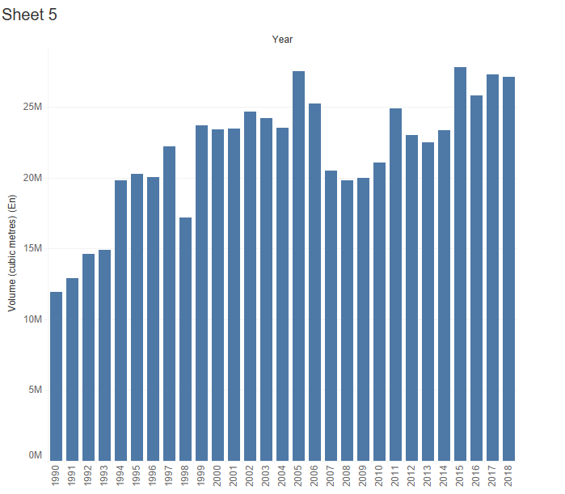

```{r setup, include=FALSE, echo = FALSE, message=FALSE}
knitr::opts_chunk$set(echo = TRUE)
```

```{r libraries, echo=FALSE, message=FALSE}
#setwd("/home/gwa/Work/historical-residue/Analysis")
setwd("g:/Shared drives/FES_Data_Sharing_Forestry/Manuscripts/histressupp")
#setwd("/mnt/chromeos/GoogleDrive/SharedDrives/FES_Data_Sharing_Forestry/Manuscripts/histressupp/analysis")
library(tidyverse)
library(ggthemes)
library(gridExtra)
library(viridis)
library(skimr)
library(scales)
library(DescTools)
library(zoo)
library(ezknitr)
#ezknit(file="analysis/manuscript.Rmd", out_dir="output", fig_dir="myfigs")
```

# Introduction

Here's something that might help our writing.  It's got the headings that *Biomass and Bioenergy* wants
and presents the main results based on our placeholder costs.  Author priority is not fixed.

Note that the figures are not fixed yet.  I think the "supply curves" are particularly
ugly, but they show our results the way they are.  The choppiness reflects the five minute
service areas, and is valuable because of that.  I am thinking that putting an
average of the 31 years in a different colour in the middle of the cloud might be helpful.

But let's not worry about the details of figure presentation yet, and focus on the writing.

## Some obvious citations

@R2021

@Wickham2019

@qgis2021

@Onyango2019

@Carriquiry2011

@Miles2009

@Dessbesell2017

@Dymond2010

@Lambert2005

@Lo2021

@Malladi2018

@Mansuy2017

@Mansuy2020

@Schroder2019

@Shabani2013

@Shooshtarian2018

@Yemshanov2018

@Zheng2021

@Ackom2010

@Acuna2019

@Boudewyn2007

@Peltola2011

## Justification

* renewable fuels better than fossil fuels
* forest harvest residue just piled and burned
* forest road networks in Alberta radiate from location
* terrain is difficult
* simple circle or doughnut models of limited utility

# Materials and methods

## Harvested area

Canada's National Forest Inventory System (NFIS) is a product of the Canadian
Council of Forest Ministers (CCFM).  One of the data sets provided by the NFIS
identifies locations of forest harvesting across Canada for the years 1985-2015
detected from Landsat satellite imagery.  These data are at a 30 m spatial 
resolution.  The data were downloaded from
https://opendata.nfis.org/downloads/forest_change/CA_forest_harvest_mask_year_1985_2015.zip
(accessed 2020-03-05).
The data set is described in @Hermosilla2016.
  
The data were clipped to the Alberta provincial boundary which was obtained from
Altalis (https://www.altalis.com, accessed 2021-09-10), which manages much of the spatial information
belonging to the Alberta government.
  
## Alberta township coverage
  
For our analysis, most of our information was aggregated to the township level.
In Alberta, the legal description of any parcel of land uses the Alberta Township
Survey System (see https://www.alberta.ca/alberta-township-survey-system.aspx, 
accessed 2021-10-08). Most townships are roughly square in shape, with an average 
area of about 9,533 ha.  The GIS coverage for township outlines was obtained 
from Altalis (https://www.altalis.com, accessed 2021-09-10).

The harvest areas obtained from the NFIS forest harvesting data set were
aggregated to the township level so that the harvest area for each township
in each of the years from 1985-2015 was recorded in a data set.

  
## Hypothetical plant locations and capacities

For this study, we assumed that forest harvest residue processing would take place
at a plant co-located with an existing forest products manufacturing facility.
We used the Weyerhaeuser oriented strand board plant in Edson, the Millar Western
Forest Products Ltd. pulp mill in Whitecourt, and the West Fraser pulp mill 
in Hinton as the locations
for the hypothetical forest residue processing facilities.

As well as considering locations for the hypothetical plants, we considered
3 different pland capacities: 200,000 odmt/yr corresponding to a small 
wood pellet mill, 400,000 odmt/yr corresponding to a large pellet mill or
a small ethanol plant, and 800,000 odmt/yr corresponding to a large ethanol 
plant.

  


## Alberta road network
  
** A nice picture demonstrating dendritic nature of road network ** 
   
  * The provincial road network was sorted into four classes:

    * primary provincial highways

    * other paved roads

    * two-lane gravel roads

    * one-lane gravel or dirt roads

  * Average speeds calculated using harmonic mean:
    
       $s_h= \left(\frac{s_u^{-1} + s_l^{-1}}{2}\right)^{-1}$
  
  * Speeds by road class, loaded and unloaded:

    * primary provincial highways: loaded 80, unloaded 95, h-mean 85

    * other paved roads: loaded 65, unloaded 80, h-mean 70

    * two-lane gravel roads: loaded 50, unloaded 70, h-mean 60

    * one-lane roads: loaded 20, unloaded 30, h-mean 25
  
## service areas

  * Rasterized network areas were generated using the QGIS plugin, QNEAT3 (Iso-Area as Interpolation).
  
  * QGIS zonal statistics were used to calculate the median network travel time in each township.
  
  
```{r haul, echo=FALSE, fig.cap="Alberta road network (left) and one-way haul time from Edson, limited to 6 hours.", out.width = '100%'}
knitr::include_graphics("../img/network_service.png")
```
  
## Harvestable volume by township

* based on NRCan 250 m data
    * filtered merch vol >= 50
    * Larches + birches <= 50
    * age >= 80
    * adjusted volumes to give average harvested volumes on West Fraser (Hinton).
    Gives some locally adjusted volumes.  Kludgy, but maybe better than a
    provincial average.

# Theory/Calculation

So here we set the constants.

```{r constants, echo=FALSE, include=FALSE}
#hourly_truck_rate <- 175 + 225 + 40 #place holder.
# info fromhttps://www.rogerstrucking.ca/services/rates-and-equipment/62-tractor-truck-hourly-rates
# 175 $/hr for tractor, 225 for walking floor trailer, 40 for operator

#hourly_truck_rate <- 175 # adjusted from Roger's numbers to be more in line with Roeser
trailer_capacity <- 100 #m^3 from https://www.newtontrailers.com/trailer_hire/biomass_moving_floor_trailer/-/54/0
hourly_truck_rate <- 175 #$/hr
solid_volume_factor <- 0.4 #from fortsv5
adj_trailer_capacity <- trailer_capacity * solid_volume_factor
specific_gravity <- 0.38 #lodgepole pine
odt_trailer <- specific_gravity * adj_trailer_capacity
truck_rate <- hourly_truck_rate / odt_trailer

#truck_rate <- 6.43 # $/odt/hr
prepiling_cost <- 6.30 # $/odt
comminution_cost <- 25.60 # $/odt
other_cost <- 8.48 # $/odt
constant_cost <- prepiling_cost +  comminution_cost + other_cost # $/odmt
location <- c('Whitecourt','Edson','Hinton')
capacity <- c(200000,400000,800000)

merch_vol_adj_factor <- 2.38
odmt_adj_factor <-  0.10

#get prop of dec/con by twp
standing_time <- 20

```

Following @Roser2013, the pre-piling cost was set to \$`r prepiling_cost`/odmt,
the comminution (*grinding ?*) cost was set to  \$`r comminution_cost`/odmt, and
other costs were set to  \$`r other_cost`/odmt.  The total "constant" costs are 
 \$`r constant_cost`\$/odmt.

Using *blah blah blah* , the truck rate was set to 
\$`r truck_rate`/odmt/h. 

A 100 m³ trailer can haul `r odt_trailer` odmt of chipped residue.

```{r read_data_files, echo=FALSE}
t <- read.csv(file = '../data/township_merchantable_volume.csv')
twp_merch_vol <- t %>% select(c(TRM,mean_merch_volume)) 
twp_merch_vol$adj_vol <- twp_merch_vol$mean_merch_volume * merch_vol_adj_factor
#twp_merch_vol$residue_odmt <- twp_merch_vol$adj_vol * odmt_adj_factor
load("../data/biomass_by_trm.RData")
twp_merch_vol <- merge(twp_merch_vol,biomass_by_trm,by = "TRM", all = TRUE)
twp_merch_vol <- twp_merch_vol %>% 
  mutate(adj_factor = res_total/adj_vol)

mean(twp_merch_vol$adj_factor)

t <- read.csv(file = '../data/harvest_township_stats_melt_area.csv')
t <- subset(t, select = c(TRM,year,harvest_ha)) %>% filter(year >=1990)
t <- merge(t, twp_merch_vol, by = "TRM", all=TRUE)
t$adj_vol <- t$adj_vol %>% replace_na(0)  # there is an NAs problem here.  replace NAs with average.
                                              # is that the right way to do it?
t$harvest_vol <- t$harvest_ha * t$adj_vol 
t$residue_odmt <- t$harvest_ha * t$res_total
t <- t %>% 
  filter(!is.na(residue_odmt))


harv <- subset(t, harvest_ha > 0)
head(harv)
summary(harv$harvest_ha)
summary(harv$harvest_vol) 
summary(harv$adj_vol)

#harv2 <- aggregate(harv$harvest_vol,by=list(Category=harv$year), FUN=sum)
harv2 <- harv %>% group_by(year) %>%
  summarise(harvest_vol = sum(harvest_vol)) 
# %>%
#   mutate(hvol2=rollapply(harvest_vol,5,mean,align='left',fill=NA))

summary(harv2$harvest_vol)
harv2

harv3 <- read.csv(file = '../data/ABHarvestVol.csv') %>% filter(year >=1990)
harv3 

harv4 <- merge(harv2, harv3, by = "year", all=TRUE)

ggplot(data=harv4, aes(x=year)) +
  geom_line(aes(y = harvest_vol), colour="darkred") +
  geom_line(aes(y = harvvol), colour="steelblue") +
  labs(x = "year") + labs(y = "harvest volume (million m3)")  +
  scale_y_continuous(limits=c(0,30e6),labels = label_number(scale = 1/1e6)) 

#2009 is the median harvest volume year for Alberta in 1990-2015

ggplot(data=harv2, aes(x=year,y=harvest_vol)) +
  labs(x = "year") +
  labs(y = "harvest volume (million m3)") +
  geom_line()  +
  scale_y_continuous(limits=c(0,30e6),labels = label_number(scale = 1/1e6)) 
# +
#   scale_colour_viridis(discrete = TRUE) +
#   theme(legend.position = "none") +
#   facet_grid(cols=vars(location)) +
#   scale_x_continuous(limits=c(0,800000),labels = label_number(scale = 1/1000))


t <- read.csv(file = '../data/interpolated_median_oneway_times_seconds.csv')

d <- pivot_longer(t,cols=c("edson_median","hinton_median","whitecourt_median"),names_to = "location")
d <- d %>% mutate(location=recode(location,whitecourt_median="Whitecourt",edson_median="Edson",hinton_median="Hinton"))
#d <- select(d, -sum)
d$cycleTime <- 2* (d$value/3600) + standing_time/60

d$residueCost <- d$cycleTime * truck_rate + prepiling_cost + comminution_cost + other_cost
d <- select(d, -value)

head(d)

big_joined <- inner_join(d,harv, by = "TRM")
head(big_joined)
tail(big_joined)

cum.odmt <- big_joined %>%
  arrange(location,year,cycleTime) %>%
  group_by(location,year) %>%
  mutate(residue.cumsum=cumsum(residue_odmt))


```
As a check, we obtained harvest levels for the period 1990-2018 from the National
Forestry Database @ccfm2020 .  Note that in 1998, industrial salvage volumes of 369,791 m³ of 
softwood and 264,647 m³ are not included in the harvest levels shown in the graph

```{r pressure, echo=FALSE, fig.cap="NFDP harvest levels", out.width = '100%'}

```


Some lovely supply curves


```{r supply_curves, echo=FALSE, warning=FALSE, fig.cap="Residue supply (cycle time) curves by location.  Each curve represents one year.  The red curve is for 2009, which was the year of median harvest volume."}


p <- ggplot(data=cum.odmt, aes(x=residue.cumsum,y=cycleTime,group=year,colour=as.factor(year))) +
  labs(x = "cumulative residue (1000 odmt)") +
  labs(y = "cycle time (hr)") +
  geom_line() +
  scale_colour_manual(values=c("Grey","Grey","Grey","Grey","Grey","Grey","Grey",
                               "Grey","Grey","Grey","Grey","Grey","Grey","Grey",
                               "Grey","Grey","Grey","Grey","Grey","Red","Grey",
                               "Grey","Grey","Grey","Grey","Grey","Red")) +
#  scale_colour_viridis(discrete = TRUE) +
  geom_line(data=cum.odmt[cum.odmt$year==2009,],aes(x=residue.cumsum,y=cycleTime, colour="Red"))+
  theme(legend.position = "none") +
  facet_grid(cols=vars(location)) +
  scale_x_continuous(limits=c(0,800000),labels = label_number(scale = 1/1000))+
  scale_y_continuous(limits=c(0,12)) 

p 


```


```{r more_supply_curves, echo=FALSE, warning=FALSE, fig.cap="Residue supply (delivered cost) curves by location.  Each curve represents one year.  The red curve is for 2009, which was the year of median harvest volume."}
ggplot(data=cum.odmt, aes(x=residue.cumsum,y=residueCost,group=year,colour=as.factor(year))) +
  labs(x = "cumulative residue (1000 odmt)") +
  labs(y = "marginal cost ($/odmt)") +
  geom_line() +
  scale_colour_manual(values=c("Grey","Grey","Grey","Grey","Grey","Grey","Grey",
                               "Grey","Grey","Grey","Grey","Grey","Grey","Grey",
                               "Grey","Grey","Grey","Grey","Grey","Red","Grey",
                               "Grey","Grey","Grey","Grey","Grey","Red")) +
#  scale_colour_viridis(discrete = TRUE) +
  geom_line(data=cum.odmt[cum.odmt$year==2009,],aes(x=residue.cumsum,y=residueCost, colour="Red"))+
  theme(legend.position = "none") +
  facet_grid(cols=vars(location)) +
  scale_x_continuous(limits=c(0,800000),labels = label_number(scale = 1/1000)) +
  scale_y_continuous(limits=c(50,175)) 
```

```{r boxplots, echo=FALSE, warning=FALSE, fig.cap="Distribution of residue costs by location, capacity, and year"}
t200 <- cum.odmt %>% filter(residue.cumsum <= 200000)
t200$capacity <- 200
t400 <- cum.odmt %>% filter(residue.cumsum <= 400000)
t400$capacity <- 400
t800 <- cum.odmt %>% filter(residue.cumsum <= 800000)
t800$capacity <- 800

t <- bind_rows(t200,t400)
t <- bind_rows(t,t800)

t <- t %>%
  arrange(year,location, cycleTime) 

p <- ggplot(t,aes(factor(year),residueCost))  + 
  geom_tufteboxplot() +  
  facet_grid(cols=vars(location),rows=vars(capacity)) +
  labs(y = "residue cost ($/odmt)", x="year") +
  scale_x_discrete(breaks=c("1990","","","","","1995","","","","","2000","","","","","2005","","","","","2010","","","","","2015")) +
  theme(axis.text.x = element_text(angle=90))
p

```

```{r avecosts, echo=FALSE, warning=FALSE, fig.cap="Average costs by location, capacity, and year "}

t <- t %>%
  arrange(location, capacity, year)

avet <-t %>%
  group_by(location,capacity, year) %>%
  summarize(avecost = mean(residueCost))


ggplot(data=avet, aes(x=year,y=avecost,colour=location))+
  labs(x = "year") +
  labs(y = "average cost ($/odmt)") +
  geom_line() +
  facet_grid(rows=vars(capacity)) +
  scale_y_continuous(limits=c(60,150)) 

```


# Results and discussion

Whitecourt is low cost for most years at all capacities.  Noticable spike in
1999.  Probably due to Virginia Hills fire salvage.  Note that this spike
also affects Hinton and Edson at 800,000 odmt capacity, because they reach into the 
Whitecourt area.

As expected, residue costs are lower with lower capacities because they don't have to reach
so far out.

# Conclusions

# Data availability

# Acknowledgements

This research was supported by funding from the Canada First Research Excellence Fund as part of the University of Alberta’s Future Energy Systems research initiative.

Dennis Gray contributed to data compilation.

# Literature cited
