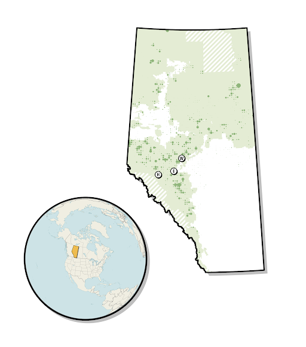
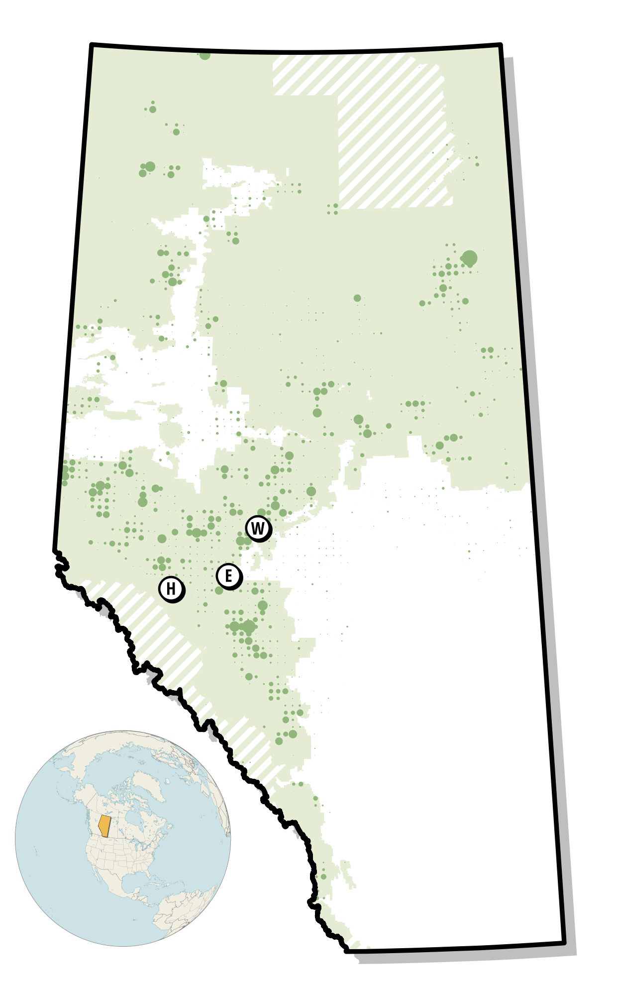
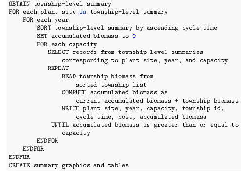
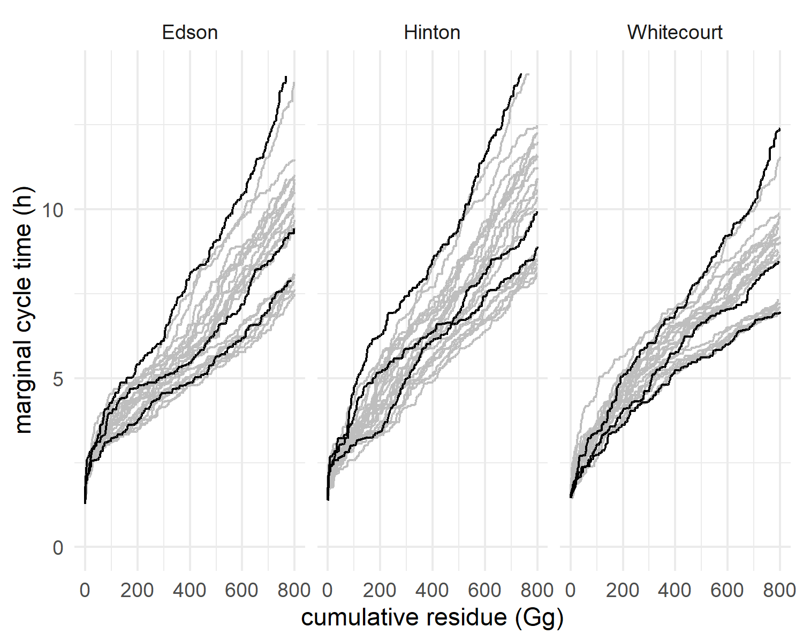
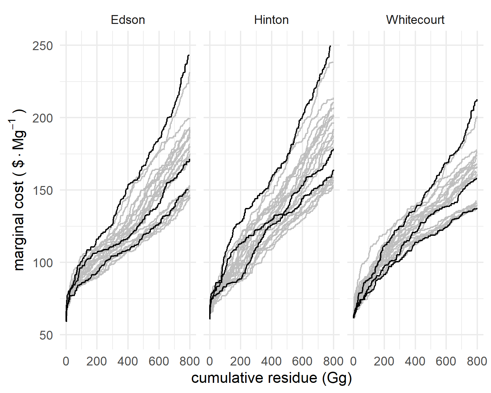
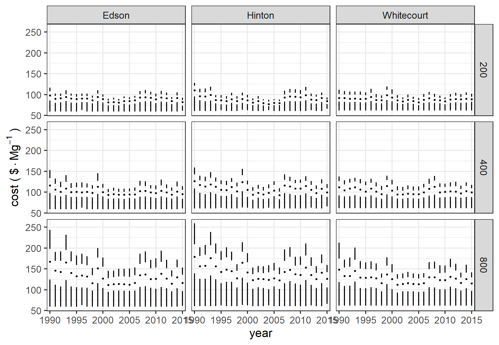
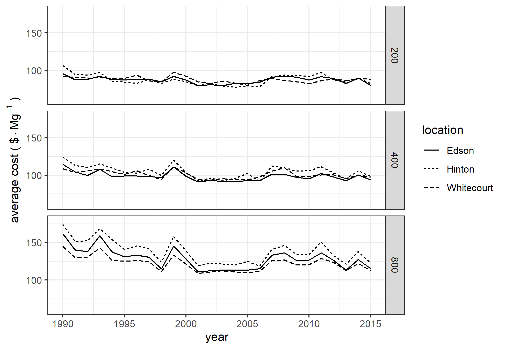
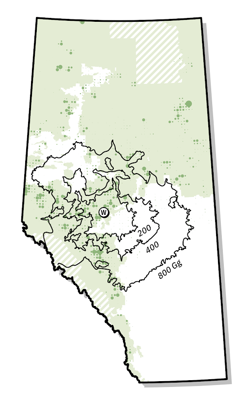
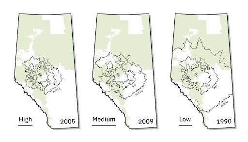
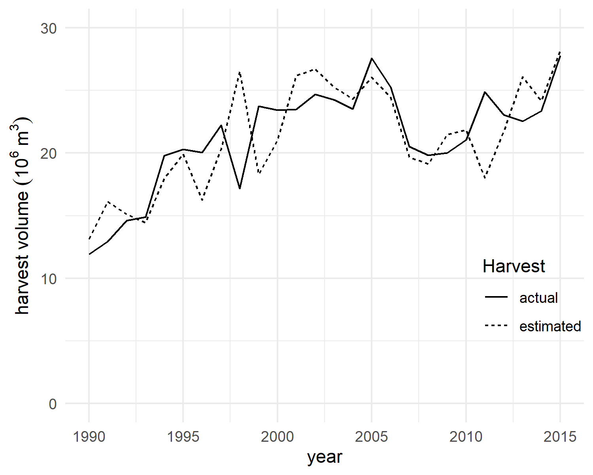

\pagenumbering{gobble}

\raggedright

```{r setup, include=FALSE, echo = FALSE, message=FALSE}
knitr::opts_chunk$set(echo = TRUE)
```

```{r libraries, echo=FALSE, message=FALSE}
setwd("G:/Shared drives/FES_Data_Sharing_Forestry/Manuscripts/histressupp/analysis/ms_july")
#setwd("/mnt/g/Shared drives/FES_Data_Sharing_Forestry/Manuscripts/histressupp/analysis")
#setwd("/mnt/chromeos/GoogleDrive/SharedDrives/FES_Data_Sharing_Forestry/Manuscripts/histressupp/analysis")
library(tidyverse)
library(ggthemes)
library(scales)
library(gt)
library(quantmod)
library(bookdown)
```


\newpage

# Tables {-}


Table 1:  Average road speeds(km/h) by road class.

| Road class      | loaded | unloaded | harmonic mean | 
|:----------------|-------:|---------:|--------------:|
| primary highways|    85  |       95 |           90  |
| other paved     |    77  |       86 |           81  |
| 2-lane gravel   |    60  |       67 |           63  | 
| 1-lane gravel or dirt  |    29  |       25 |           27  | 
| no road           |     5  |       5  |           5   |

Table 2:  Summary statistics for residue costs by location and capacity.

```{r ave, echo=FALSE}
load("../../data/AveTable.RData")
aveTable
```

\newpage


# Figures {-}


```{r harvesttwp, echo=FALSE, fig.cap="Harvest areas for the year 2009 aggregated to township level.  Size of circles indicates township harvest area.  Harvests are shown relative to Alberta's Green and White Areas, and those areas not in either (cross-hatching).  The locations of Hinton, Edson, and Whitecourt are indicated on the map."}

#
```


```{r haul, echo=FALSE, fig.cap="Alberta road network (left) and cycle time (right) from Whitecourt, limited to 14 hours."}
knitr::include_graphics("../../img/network_service.png")
```


```{r pcode, echo=FALSE, fig.cap="Pseudocode demonstrating greedy optimization model."}

```


```


<!-- ```{r residue, echo=FALSE, fig.cap="Biomass residue available from harvest.", out.width = '100%'} -->
<!-- knitr::include_graphics("../img/residue.png") -->
<!-- ``` -->


```{r cyclePlot, echo=FALSE, fig.cap="Distribution of cycle times by location for each of the years 1990--2015.  Black curves are for a low harvest level year (1990), a medium harvest level year (2009), and a high harvest level year (2005).  Gray curves are for each of the other 23 years."}

#suppressWarnings(print(cyclePlot))
```


```{r mcpPlot, echo=FALSE, fig.cap="Distribution of marginal costs by location for each of the years 1990--2015.  Black curves are for a low harvest level year (1990), a medium harvest level year (2009), and a high harvest level year (2005).  Gray curves are for each of the other 23 years."}

#suppressWarnings(print(mcPlot))
```

```{r bPlot, echo=FALSE, fig.cap="Boxplots of costs by location and biomass requirements for the years 1990--2015."}

#suppressWarnings(print(bPlot))
```

```{r avePlot, echo=FALSE, fig.cap="Average costs by location and year."}

#suppressWarnings(print(avePlot))
```


```{r w2009, echo=FALSE, fig.cap="Relationship between township timber harvest intensity and required supply area for facilities with biomass requirements of 200, 400, and 800 Gg/a.  The size of the dots reflects the proportion of the area of each township harvested in 2009."}

```


```{r wcontour, echo=FALSE, fig.cap="Supply area for facilities in Whitecourt with biomass requirements of 200, 400, and 800 Gg/a for high harvest (2005), medium harvest (2009), and low harvest (1990) years."}

```


```{r merchvol, echo=FALSE, fig.cap="Merchantable volume by township.  The left panel indicates total merchantable volume in the township from the 250 m data, and the boundaries of Alberta's green and white areas.  The right panel shows the assumed volume per harvested hectare."}
knitr::include_graphics("../../img/Merchantable Volume.png")
```


<!-- ```{r pressure, echo=FALSE, fig.cap="Comparison of actual harvest levels for Alberta from the national forestry database and values estimated for this study."} -->
<!--  -->
<!-- #suppressWarnings(print(harv_comparison)) -->