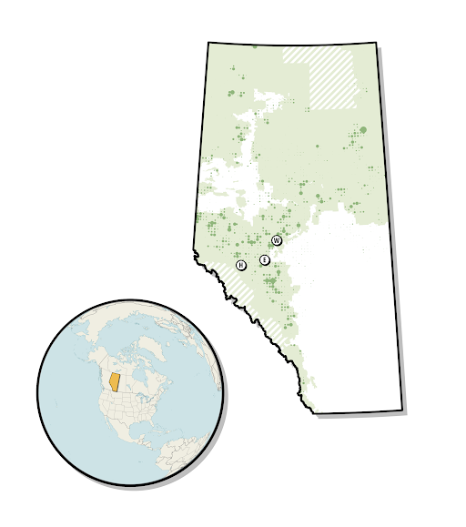
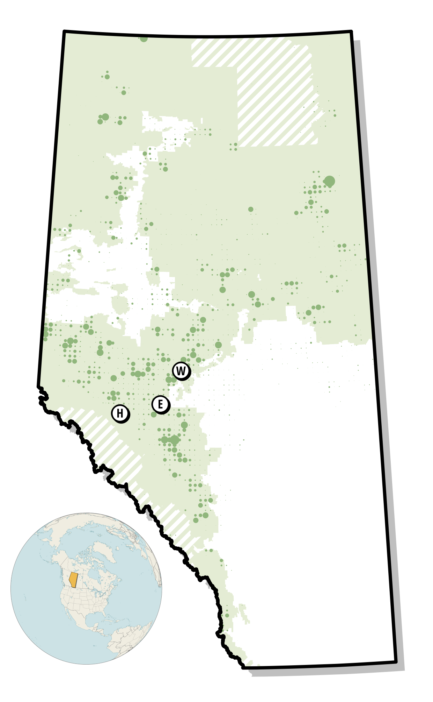
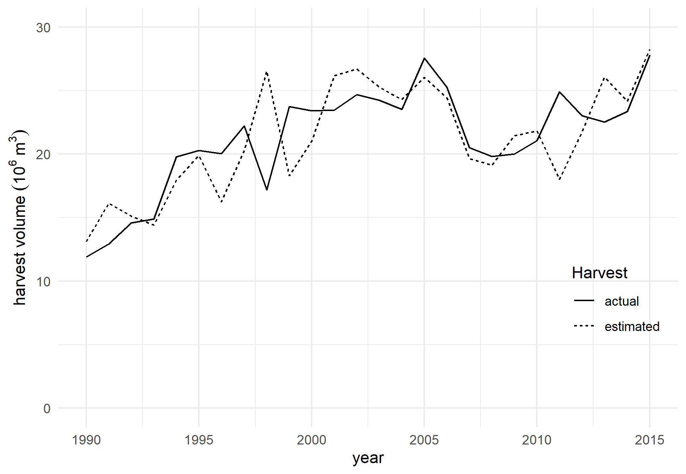
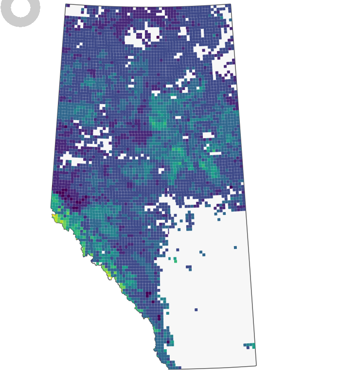
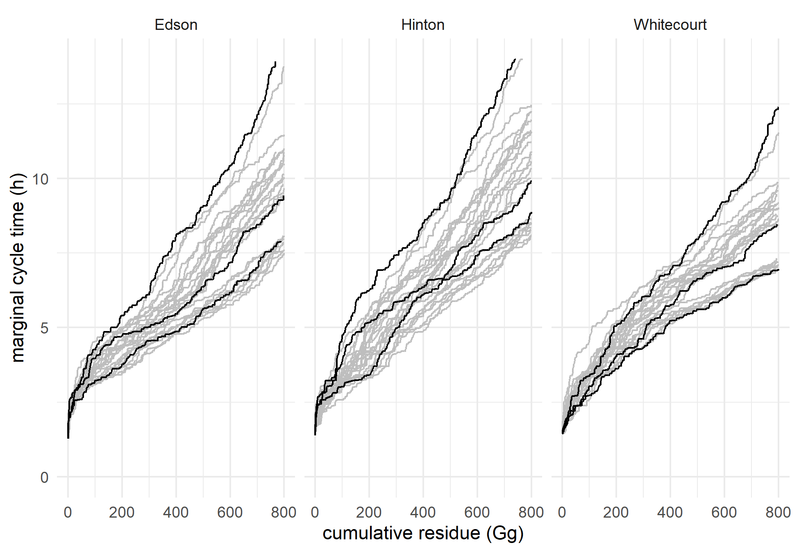
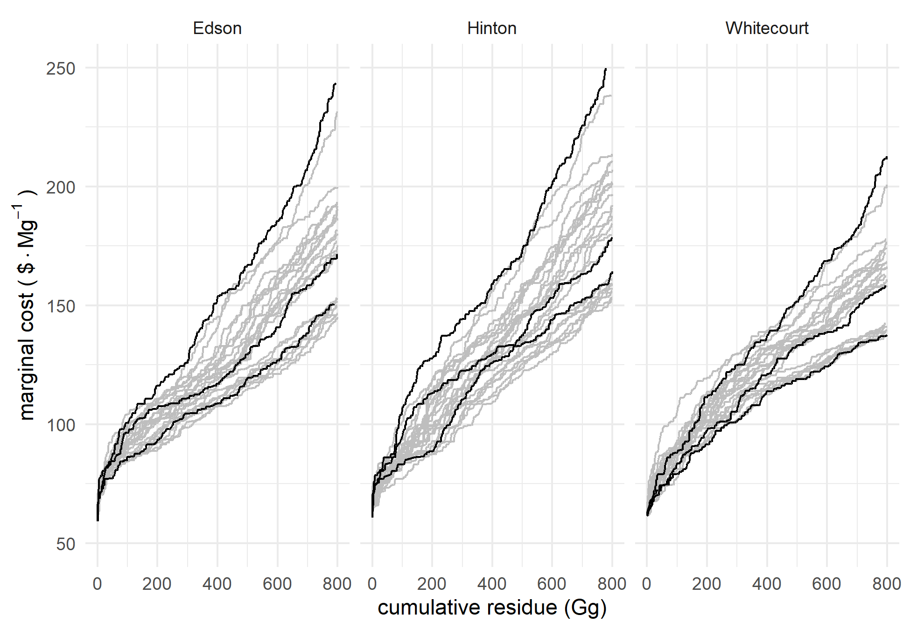
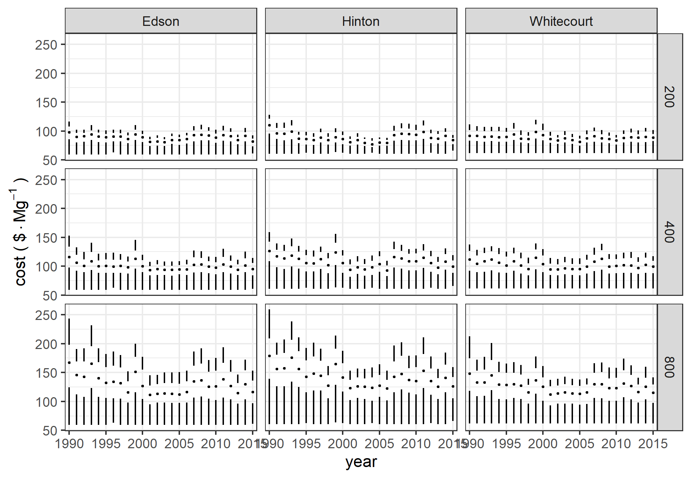
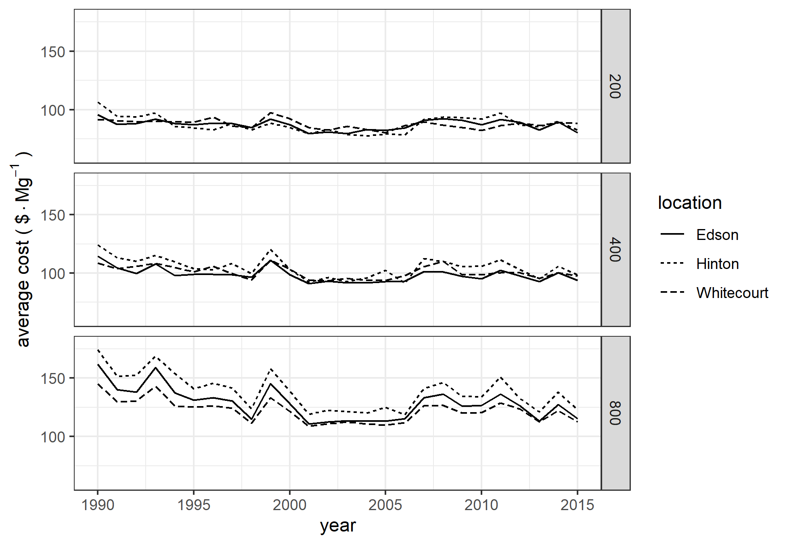
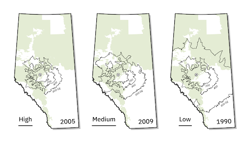

\raggedright

```{r setup, include=FALSE, echo = FALSE, message=FALSE}
knitr::opts_chunk$set(echo = TRUE)
```

```{r libraries, echo=FALSE, message=FALSE}
#setwd("G:/Shared drives/FES_Data_Sharing_Forestry/Manuscripts/histressupp/analysis")
#setwd("/mnt/g/Shared drives/FES_Data_Sharing_Forestry/Manuscripts/histressupp/analysis")
#setwd("/mnt/chromeos/GoogleDrive/SharedDrives/FES_Data_Sharing_Forestry/Manuscripts/histressupp/analysis")
library(tidyverse)
library(ggthemes)
library(scales)
library(gt)
library(quantmod)
library(bookdown)
```


\newpage

# Tables {-}


Table 1:  Road speeds by road class based on FPInnovations (km/h).

| Road class      | loaded | unloaded | harmonic mean | 
|:----------------|-------:|---------:|--------------:|
| primary highways|    85  |       95 |           90  |
| other paved     |    77  |       86 |           81  |
| 2-lane gravel   |    60  |       67 |           63  | 
| 1-lane gravel or dirt  |    29  |       25 |           27  | 
| no road           |     5  |       5  |           5   |

Table 2:  Summary statistics for residXsdue costs by location and capacity.

```{r ave, echo=FALSE}
load("../data/AveTable.RData")
aveTable
```

\newpage


# Figures {-}


```{r harvesttwp, echo=FALSE, fig.cap="Harvest areas for 2009 with aggregated to township level.  Size of circle indicates harvest area in a township in 2009.  Harvests are shown relative to Alberta's Green and White Areas, and those areas not in either (cross-hatching).  The locations of Hinton, Edson, and Whitecourt are indicated on the map."}

#
```


\newpage
\blandscape
```{r haul, echo=FALSE, fig.cap="Alberta road network (left) and cycle time (right) from Whitecourt, limited to 14 hours."}
knitr::include_graphics("../img/network_service.png")
```
\elandscape
\newpage


```{r pressure, echo=FALSE, fig.cap="Actual harvest levels from the national forestry database compared with estimated values."}

#suppressWarnings(print(harv_comparison))
```


\newpage
\blandscape

```{r merchvol, echo=FALSE, fig.cap="Merchantable volume by township.  The left panel indicates total merchantable volume in the township from the 250 m data, and the boundaries of Alberta's green and white areas.  The right panel shows the assumed volume per harvested hectare."}
knitr::include_graphics("../img/Merchantable Volume.png")
```
\elandscape
\newpage

<!-- ```{r residue, echo=FALSE, fig.cap="Biomass residue available from harvest.", out.width = '100%'} -->
<!--  -->
<!-- ``` -->


\newpage
```{r cyclePlot, echo=FALSE, fig.cap="Distribution of cycle times by location for each of the years 1990--2015.  Black curves are for a low harvest level year (1990), a medium harvest level year (2009), and a high harvest level year (2005).  Gray curves are for each of the other 23 years."}

#suppressWarnings(print(cyclePlot))
```


\newpage
```{r mcpPlot, echo=FALSE, fig.cap="Distribution of marginal costs by location for each of the years 1990--2015.  Black curves are for a low harvest level year (1990), a medium harvest level year (2009), and a high harvest level year (2005).  Gray curves are for each of the other 23 years."}

#suppressWarnings(print(mcPlot))
```

\newpage
```{r bPlot, echo=FALSE, fig.cap="Boxplots of costs by location and biomass requirements for the years 1990--2015."}

#suppressWarnings(print(bPlot))
```

\newpage
```{r avePlot, echo=FALSE, fig.cap="Average costs by location and year."}

#suppressWarnings(print(avePlot))
```
\newpage

```{r w2009, echo=FALSE, fig.cap="Relationship between township timber harvest intensity and required supply area for facilities with biomass requirements of 200, 400, and 800 Gg/a.  The size of the dots reflects the proportion of the area of each township harvest in 2009"}
knitr::include_graphics("../img/whitecourt2009.png")
```

\newpage

```{r wcontour, echo=FALSE, fig.cap="Supply area for facilities in Whitecourt with biomass requirements of 200, 400, and 800 Gg/a for high harvest (2005), medium harvest (2009), and low harvest (1990) years."}

```

\newpage   
