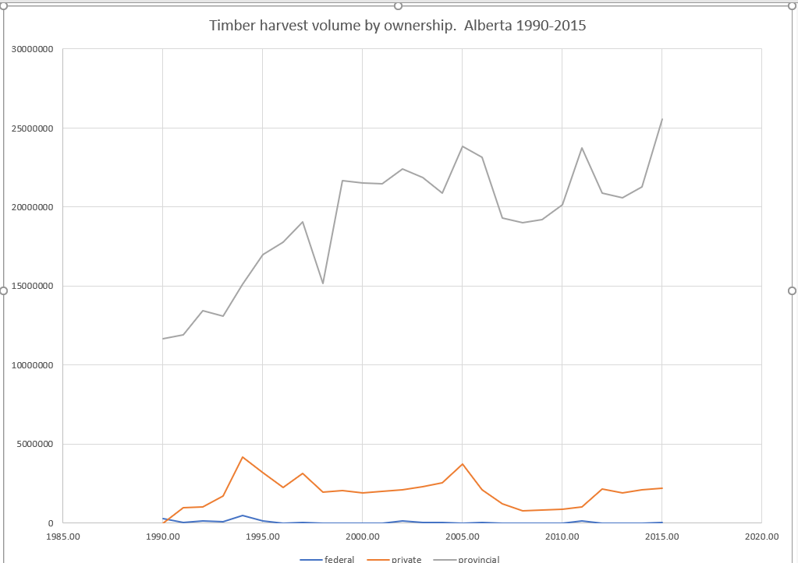

# Introduction

Humans have been using biofuels since we learned to control fire a
million or so years ago. In developed economies, biofuels were largely
displaced by coal during the industrial revolution, and by petroleum
starting in the mid-nineteenth century. In recent times, biofuels are an
increasingly important source of energy because of their potential to
reduce dependency on fossil fuels and reduce greenhouse gas emissions.
Direct combustion of biomass is still an important source of energy. In
Europe, in particular, many electricity plants have been converted to
use wood pellets instead of coal as the primary energy source. Liquid
biofuels (*e.g.* ethanol and biodiesel) have been produced in commercial
quantities from food crops starting in the 1980s. These are called first
generation biofuels. A major difficulty with these first generation
biofuels is that they compete with food and that their use may lead to
land use change.

Second generation biofuels rely on processes that convert
lignocellulosic materials (such a corn stover and wood) to liquid
biofuels. An advantage of this process is that the feedstock can be
residue from food or forest products production. Second generation
biofuel production is still largely in a pilot or demonstration phase.
An interesting example using forest residues is the Silva Green Fuel
renewable crude oil plant in Tofte, Norway which is expected to begin
operations in 2021 \[1\].

Wood pellets are a well-established biofuel. It is projected that Canada
will produce 3.8 million Mg of wood pellets in 2021, of which 87% will
be exported, largely to the United Kingdom, Japan, and Europe \[2\].
Wood pellets are replacing coal as the primary energy source in
electricity generating plants, particularly in Europe \[3\]. Most of the
wood pellet production in Canada comes from mill residues. There is
interest in expanding the source to the forest by collecting the residue
left on cutblocks after harvest: this practice is well-established in
Europe. Forest residues are generated as by-products of conventional
forest harvesting operations, and include the tree tops, branches and
non-merchantable logs. These residues are typically left behind in slash
piles, which are burned during winter to mitigate against the risk of
wildfires. Canada has a forestry sector that produces approximately 20
million oven-dry metric tons of forest residues annually \[4\]. For the
remainder of this paper we will express biomass using SI units, and all
quantities of biomass will be expressed on an oven-dry basis: 1 oven-dry
metric ton is equivalent to 1 Mg.

<s>Clean fuel standard
<https://gazette.gc.ca/rp-pr/p1/2020/2020-12-19/html/reg2-eng.html>
Despite the potential to produce biofuels from forest residues, such use
is limited to a few highly subsidized pilot projects. Several
operational and economic challenges hinder the utilization of forest
residues. These challenges are related to: (1) capital investments in
biorefineries, (2) geographical distance between feedstock and markets,
and (3) concerns surrounding feedstock availability \[5\]. The purpose
of our study is to explore concerns surrounding this third challenge –
feedstock availability – by evaluating annual variability in commercial
stemwood harvest in the province of Alberta, Canada.</s>

A number of studies have shown that collection and transportation costs
may be the biggest impediment to widespread use of forest residues in
bioenergy systemsX \[8\]. Availability of forest residues for a
bioenergy plant largely depends on commercial harvesting operations and
the production of traditional forest products. Fluctuations in the
volume of stemwood harvested for forest products has a direct impact on
residues available for biofuels. Major factors, such as the 2008 housing
crisis and the ongoing softwood lumber dispute with the United States
have resulted in sawmill closures and reductions in forest harvesting
activities \[9\] \[10\]. This relationship between volatile harvest
volumes and subsequent residue variability is explored in detail by
Niquidet and Friesen \[11\], who model forest residue supply in Alberta
as a function of lumber prices. Given that biomass feedstock accounts
for 40 to 60% of a bioenergy plant’s total costs \[12\], reliable
feedstock supplies and costs over the life of the bioenergy plant are
important factors to consider when deciding where to locate the
bioenergy plant.

Past studies regarding bioenergy plant locations have improved our
understanding of feedstock availability and constraint. One key area
that has largely been omitted is considerations of feedstock supply
variability over time. Commercial stemwood harvests vary year-to-year,
largely based on market conditions for forest products. Since a
forest-residue based bioenergy plant is dependent on stemwood harvesting
for feedstock, any variability in harvesting directly influences the
volume of residues that would be available. Therefore, considering the
variability associated with feedstocks in different locations could be
important in choosing the optimal site for locating a bioenergy plant

**We say above that consideration of variable feedstock supplies has
been omiXtted, and in the paragraph below that a bunch of people have
consider it. Do those studies actually consider variability?**

<s>Some studies have considered variable feedstock supplies when
investigating whether and when to expand the production of bioenergy
from burning residues \[13\] \[14\] \[15\]. Other studies have explored
the context of variable supplies when making decisions about capital
investments in forest residue-based biorefineries \[16\], \[17\] \[18\].
Variable feedstock supplies are also shown to affect capital investment
decisions related to: investing in a residue preprocessing facility
(Chen and Fay 2011) \[17\], types of storage infrastructure for
bioenergy plant feedstocks \[18\], as well as whether to invest in
biofuels versus bioenergy, and when to invest in processing facilities
\[16\].</s>

<s>There has been a number of studies conducted regarding siting
decisions for forest residue-based biorefineries – see Johnson et al
(2012) \[19\] for a review of these studies – however,</s>

We are aware of no study that considers historical variability of
stemwood harvest and its subsequent effect on forest residue
availability. Our study contributes to the literature by considering
variability in forest residue feedstock supplies.

More specifically, we analyze how this variability affects the cost of
delivering residue, and then use these cost estimates to inform the
decision on where to locate a bioenergy plant.

We consider co-locating the bioenergy adjacent to existing forest
products manufacturing facilties. Co-locating with existing facilities
and making use of established infrastructure and transportation systems
can reduce many of the costs associated with establishing a new
bioenergy plant \[**Browne2012?**\] \[**Saddler2012?**\]
\[**Benjamin2009?**\] \[**Towers2007?**\] (**I don’t have the references
for Browne2012, Saddler2012, Benjamin2009, or Towers2007**). Bioenergy
plant location should be informed by how stable the respective residue
supplies are. More stable stemwood harvest would generate a more stable
supply of forest residues that could be collected from the nearby
harvested areas.

We use information on the location and year of timber harvest in the
province of Alberta, Canada to quantify the spatial and temporal
variability of timber harvest, and relate that information to spatial
and temportal variability of production of timber harvest residues. We
develop transportation cost estimates to the timber harvest areas based
on cycle time estimates developed from the road network in the province.
From this information we develop historical techno-economic supply
curves \[22\] for forest residue biomass for each of 26 years in our
study period (1990–2015) for 3 potential biofuel plant locations.

<s>We use information The objectives of our study are …… Our approach
incorporates variable feedstock availability into decision making, and
our results provide important information for assessing the potential
for a forest residue-based biofuel industry in Alberta.</s>

The methods used for this study are similar to that used by
FPInnovations for their biomass availability estimations for timber
supply areas in British Columbia (see Ref. \[21\] for an example). Like
us, FPInnovations develops supply curves (cost-availability curves)
based on a road network and historical harvests. However, their take on
temporal variability is limited to examining 2 5-year periods. As well,
they limit their analyses to the boundaries of timber supply areas. We
do not limit ourselves with arbitrary boundaries.

Our analysis also shares similarities with work published by Yemshanov
*et al.* \[20\]. They devolop supply curves at national and regional
levels based on a national forest inventory and the location of
cogeneration facilities associated with forest products manufacturing
facilities.

The main contribution of this paper is the consideration of multiple
years to develop estimates of the temporal variability in forest residue
supply.

<s>OTHER POTENTIALLY USEFUL TIDBITS.. I left these here as a
reminder.</s>

<s>The need to go outside its normal delivery zone in bad years is
similar to a scenario in the agriculture residue feedstock supply
literature, called the the “derisked” scenario, whereby a buffer area
outside the normal supply zone is contracted to provide residues during
years when residue supply is low \[23\].</s>

<s>Modern biorefineries can expect to breakeven financially with
delivered biomass costs of approximately $80 (US$60) Mg (Steeper 2021)
\[**Steeper2021?**\] . Studies have shown that forest policy reforms
could reduce delivered forest residue costs by incenting plantations of
fast-growing tree species on lands close to pulpmill locations
(Shooshtarian et al. 2021 \[24\], Anderson et al. 2012 \[25\]). Other
important factors will be advances in biorefinery technology and
increases in biofuel prices. In Canada, governments impact biofuel
prices by setting renewable fuel mandates and paying subsidies for
biofuel production (Campbell et al., 2016). The continuation of these
mandates and subsidies will likely be an important factor for the
emergence of a second-generation (“advanced”) biofuel sector. Also, the
Government of Canada's Clean Fuel Standard, which is proposed to come
into force in 2022 (Government of Canada, 2020), is expected to improve
the economics of advanced biofuel production.</s>

# Materials and methods

We describe here our study area, data sources, and methods.

## Study area

We use the province of Alberta in western Canada as our study area. It
occupies 661 848 km<sup>2</sup>. Its southern boundary is 49°N latitude,
northern boundary is 60°N latitude, eastern boundary is 110°W longitude,
and its western boundary is defined by 120°W longitude and the Great
Divide of the Rocky Mountains (Figure 1).

\[ Figure 1 about here \]

The southeastern part of the province is largely privately owned
agricultural land, and the northern and western parts are largely
publicly owned forested land. There is, however, a substantial area of
privately owned agricultural land in the Peace River Country of
northwestern Alberta. There are also large areas in National Parks along
the Rocky Mountains and in the far north of the province. The province
calls the area of mostly publicly owned forested land (excluding those
National Parks) the Green Area, and the area of mostly privately owned
agricultural land the White Area. About 90% of the harvested timber
volume in Alberta comes from the Green Area.

For administrative purposes, the Green Area is divided into Forest
Management Units (FMUs). The province enters into long term agreements
with forest products companies giving the companies the rights to timber
harvest and the responsibility to manage the forest sustainably. These
agreements are called Forest Management Agreements, and the areas under
agreement are called Forest Management Agreement Areas (FMAAs). For the
most part, the boundaries of the FMAAs are coincident with FMU
boundaries, with the exception of the Alberta-Pacific FMAA in eastern
Alberta which comprises 12 FMUs. Maps of the FMUs \[26\] and the FMAAs
\[27\] can be found on the Government of Alberta website. The FMU and
FMAA boundaries are important to this study as they are used to assign
average piece size and utilization standards. We discuss piece sizes and
utilization standards later.

Our focus for this study is the forest near Hinton, Edson, and
Whitecourt in west-central Alberta. These locations were chosen as they
host several forest products companies and are located near forest areas
with substantial logging activity. We assume that a residual forest
biomass processing plant would be located near an existing forest
products mill as the forest road network has been developed to supply
those mills. Locating a forest residue processing plant near a forest
products mill would also allow for convenient access to mill residues.

The FMAAs which supply most of the timber to mills near our three
locations are West Fraser Mills Ltd. (Hinton), West Fraser Mills
Ltd. (Edson), Weyerhaeuser Company Limited (Pembina Timberlands), Millar
Western, Blue Ridge Lumber Inc., and ANC Timber Ltd.

We used the Weyerhaeuser oriented strand board plant in Edson, the
Millar Western Forest Products Ltd. pulp mill in Whitecourt, and the
West Fraser pulp mill in Hinton as the locations for the hypothetical
forest residue processing facilities.

As well as considering locations for the hypothetical plants, we
considered 3 different plant capacities defined by annual biomass
requirements: 200 Gg/a corresponding to a small wood pellet mill, 400
Gg/a corresponding to a large pellet mill or a small ethanol plant, and
800 Gg/a corresponding to a large ethanol plant.

## Data sources

We used a number of publicly available datasets to create the
township-level summary data used in our analysis. Most of the data are
freely available on the World Wide Web (WWW). Much of the data
processing required for this study was manipulation of spatial data.
This was done using the QGIS geographic information system software
\[28\] and add-ons. All national level data were clipped to the Alberta
provincial boundary for further analysis.

The datasets are introduced here. Their use will be discussed in detail
later.

### Altalis

Altalis manages much of the spatial data created by or for the
Government of Alberta. We use several coverages from their base features
database product \[29\]: boundaries for the province, the Green and
White Areas, forest management units (FMUs), forest management agreement
areas (FMAAs), Alberta Township Survey System (ATS\_ townships, and
towns.

The ATS boundaries are particularly important to this study as all the
data used for this study are aggregated or disaggregated to the township
level. ATS provides the basis for legal land descriptions in Alberta.
The typical township is roughly square (9.778 km by 9.716 km, 9 500 ha)
and is indexed by township (1–126), range (1–30), and meridian (4–6).
The townships immediately east of Alberta’s western boundary, and
immediately east of the 5<sup>th</sup> and 6<sup>th</sup> meridians
(corresponding to 114°W and 118°W longitude, respectively) are partial
townships and therefore deviate from the roughly square shape. ATS is
described in detail by the Alberta Land Surveyor’s Association \[30\].
There are 7 237 townships in Alberta, allowing for spatial resolution
appropriate for regional or provincial level analyses.

### Alberta Geospatial Services

Alberta Geospatial Services is operated by the Alberta Ministry of
Environment and Parks \[31\]. We obtained road access coverages from
there. A road access coverage is also available from Altalis but it does
not have as detailed information on road class.

### National Forest Information System

The National Forest Information System (NFIS) provides a set of spatial
data layers representing forest properties at a 250 m resolution for all
of Canada \[32\]. We used the merchantable volume, stand age, and
species composition attributes from these data layers.

Another product of NFIS is a set of spatial datasets derived from
satellite data \[33\]. The dataset used for this study shows the
location of timber harvest for each of the years 1985-2015. The dataset
is described in detail in Ref. \[34\]. It consists of a raster for
Canada at 30 m resolution indicating the year of harvest for each cell.

The NFIS also provides a web-based individual tree biomass calculator
\[35\]. It is used to calculate stem wood, stem bark, branch, and
foliage biomass for a tree based on province, ecozone, species, diameter
at breast height (DBH) and height. It is possible to upload a file
representing many trees with different combinations of these input
parameters and download a file containing the calculated results for all
the trees.

### Natural Resources Canada

Ref. \[36\] describes the tree taper models developed for Canada. <s>A
valuable contribution related to this is the WWW-based wood volume
calculator that uses those models \[37\].</s> We use these taper models
to determine merchantable volumes and the amount of residual biomass
available from cutblocks in each of the townships in each year.

### National Forestry Database

The National Forestry Database \[38\] was used to summarize the timber
harvest volume and harvest area from Alberta for the years 1990-2015.
This information is used to adjust the volumes obtained from the 250 m
resolution inventory to better reflect average harvest volumes observed
in Alberta.

### Forest management plans

The Alberta government requires FMA holders to develop a forest
management plan for the FMAA. The forest management plans were used to
obtain information on utilization standards and average piece size of
harvested trees for the FMAA \[39\].

### Agriculture and Agri-Food Canada

The boundaries of Canada’s terrestrial ecozones can be found on
Agriculture and Agri-Food Canada’s website \[40\]. Ecozone is an input
to the individual tree biomass calculator \[35\].

# Data aggregation and modeling

The GIS analysis for this paper was done using QGIS \[28\]. Data
summaries and statistical analysis were done using R \[41\] with RStudio
\[42\], and tidyverse \[43\].

The primary objective of this paper was to quantify the spatial and
temporal variability of the costs associated with recovering the
residual biomass left on forest cutblocks following timber harvest. A
driving assumption for this model was that residue recovery is
opportunistic. Loggers make the decision about what and where to
harvest, and the biomass recovery occurs at some time following timber
harvest. The decision to harvest is made independently of any knowledge
of the value of residue as biomass. The biomass <s>gleaners</s>
harvesters provide a service to the loggers as the residue would be
piled and burned if it was not recovered as biomass.

Every township is associated with a cycle time (and cost) required to
transport harvest residue from the township to each of our 3 plant
locations, a measure of residual biomass for each of the 26 years in the
study period. For each plant location and year, the model examines all
the townships in the province that have a positive residual volume, and
begins the creation of cumulative residual biomass curves starting with
the lowest cycle time first. These lists of cycle time and cumulative
biomass provide the data for the marginal cycle time and cost curves.

This is a greedy algorithm. It ignores the cost of moving equipment from
one block to another, but we believe it still provides useful
information.

## Cycle time estimates

The provincial road network was divided into four classes: primary
highways, other paved roads, two-lane gravel roads, and one-lane gravel
or dirt roads. Loaded and unloaded travel speeds were assumed for each
road class, according to Table 1. These travel speeds are based on those
assumed by FPInnovations for the Dawson Creek Timber Supply Area in the
neighbouring province of British Columbia \[21\].

The harmonic mean of loaded and unloaded speeds was calculated using Eq.
1.

$$
    \\bar{s\_h}=\\left(\\frac{s\_l^{-1} + s\_u^{-1}}{2}\\right)^{-1}
$$

where *s*<sub>*l*</sub> is the loaded speed and *s*<sub>*u*</sub> is the
unloaded speed. Use of harmonic mean allows us to calculate the correct
cycle time: the time required to travel from the mill, to the collection
site at the cutblock, and back to the mill. This provides the basis for
our estimates of haul cost.

Figure 2 illustrates the road network in Alberta and estimates of cycle
time based on the average of loaded and unloaded speeds from Table 1.
The road network in the White Area of the province is very dense and
largely arranged as a grid related to the Alberta Township Survey
System. Most of the roads in the White Area are public. The road network
in the Green Area is less dense and many of the roads are built and
maintained by resource industries (*e.g.* forestry and petroleum &
natural gas). The pattern of the road network is not as regular as in
the White Area.

\[ Figure 2 about here\]

One-way haul times based on the harmonic mean travel speed were
generated using the QGIS Network Analysis Toolbox 3 plug-in (QNEAT3)
~created by Raffler~ \[44\], specifically its iso-area as interpolation
(from point) algorithm. In our case, we used the algorithm to determine
the minimum one-way travel time (using the harmonic mean of loaded and
unloaded speeds) along the road network from each of our centres to each
cell of a provincial level raster at a 200 m resolution. Off-road travel
was assumed to be at 5 km/h. The Dijkstra algorithm \[45\] is the basis
for travel time minimization. Cycle times were calculated by multiplying
the one-way haul time by 2, and adding 1 hour for loading and unloading.

QGIS zonal statistics were used to calculate the median cycle time to
each township, from each of our three centres. The cycle time in Figure
2 was limited to 14 hours because, in Alberta, drivers of commercial
vehicles are not permitted to drive more than 13 hours in a 24-hour
period, and spend no more that 14 hours on-duty, including loading and
unloading times.

## Biomass collection costs

All costs and prices used in this study are in Canadian dollars ($). At
the time of writing (2021-11-30 22:48:45 GMT), the exchange rate between
Canadian (CAD) and US dollars (USD) was 0.7827 USD/CAD.

All measures of biomass used in this study are reported in SI units on a
dry matter basis: 1 Mg is therefore equivalent to 1 oven dry metric ton.

We assume that the biomass available for collection at a cutblock
includes the tops, branches, and foliage left at a roadside landing
after processing by a stroke delimber. The delimber is assumed to top
the log at the top diameter specified in the utilization standard
relevant to the harvest area. Our focus in this study is on the spatial
and temporal variation in biomass collection costs based on residue
availability associated with cycle times. Following Ref. \[46\],
<!-- the pre-piling cost was set -->
<!-- to  6.30 \$·Mg^-1^ , the comminution -->
<!-- cost (@Blackburn2020a) was set to 26.82 -->
<!-- \$·Mg^-1^ , and other costs (roads, -->
<!-- supervision, overhead, maintenance, and compliance) were set  -->
<!-- to  8.48 \$·Mg^-1^ .   --> the cost of recovering residues from a
roadside stroke-delimber , excluding transport, is 41.60
$·Mg<sup>-1</sup>.

We assume that the residue will be transported from the forest using a
live floor chip van with 100 m<sup>3</sup> capacity. The USDA Forest
Service’s Forest Residue Transportation Costing Model \[47\] assumes a
default solid volume factor of 0.3 for biomass meaning that a 100
m<sup>3</sup> capacity trailer could hold the equivalent of 30
m<sup>3</sup> of solid biomass.

This equates to 11.40 Mg of biomass using the specific gravity of
lodgepole pine wood and bark on a green volume basis ( 0.38) (Ref.
\[48\]).

Timber Tracks produces a publication describing forestry equipment
hourly rates \[49\]. The rate reported for a tandem tractor with a
tandem trailer was 157.31 $/h. We assume that the tractor-trailer
combination used to haul biomass would cost a similar amount.

Therefore, the cost of transporting residual biomass was set to 13.80
$·Mg<sup>-1</sup>·h<sup>-1</sup>.

## Harvested area

The areas harvested by township in 2009 according to Refs. \[33\] \[34\]
are shown in relationship to the three plant locations and the Green
Area in Figure 1. Similar aggregated data were created for each of the
years 1990–2015. For each township, and each of the years between 1990
and 2015, we store the area harvested (ha) for use in our analysis. We
can see from this map that a great deal of timber harvest took place
near our hypothetical plant locations in 2009.

These data were created by using QGIS zonal statistics to sum the area
harvested in each township in each year based on the 30 m resolution
harvest data \[33\].

## Utilization standards

Many forest products companies operate in Alberta, and the details of
their agreements with the government with respect to forest management
differ. Some companies have harvesting rights to just the needleleaf
species, others have rights to just the broadleaf species, and some have
rights to both needleleaf and broadleaf.

Utilization standards in Alberta are specified on the basis of stump
height, minimum stump diameter (outside bark), and minimum log length to
a specified top diameter (inside bark). Utilization standards vary by
FMU. Stump heights used in Alberta are 15 and 30 cm; stump diameters are
13 or 15 cm; top diameters range between 7 and 12 cm; and minimum log
lengths range between 2.44 and 4.88 m. These utilization standards are
necessary to relate volumes calculated to the 13+/7 cm standard for the
National Forest Inventory to the harvest volumes reported by the
companies. Perhaps most importantly, the minimum top diameter will have
an effect on the volume of residue left in the forest corresponding to
the tops of trees.

Based on the FMU boundaries, we assign a needleleaf and broadleaf
utilization standard to each township.

## Characteristics of the average tree

### Piece size

FMA holders are required by Alberta to project average piece size of
harvested trees in the detailed forest management plans (DMFPs) for
their FMAAs. We use these piece sizes projected for the first period of
the DMFP. They range from 0.110 to 0.599 m<sup>3</sup> per tree. We used
the piece size reported for the first 5-year period of the 200-year
planning horizon. For those areas where piece size was not reported we
assumed an average piece size of 0.278 m<sup>3</sup> for needleleaf
trees and 0.264 m<sup>3</sup> for broadleaf trees. These are the average
of the values reported in the forest management plans. These values are
based on the utilization standards used on the FMA. Based on the FMU
boundaries we assign an average piece size for broadleaf and needleleaf
trees to each township.

### Taper functions

Ref. \[36\] presents taper models and the associated coefficients for
the tree species found in Canada. These taper models can be used to find
the diameter at any point along the main bole of a tree given species
and diameter at breast height (DBH). DBH is a commonly used tree
measurement and is the diameter of the tree measured at 1.3 m above
ground level, in most jurisdictions, including Alberta. It is
straightforward to determine cross-sectional area of the tree at any
height. Integrating this area function will yield volume between any two
heights.

Ref. \[36\] describes a one-parameter model which is useful when both
tree DBH and height measurements are available.
$$
d(d\_b,h) = \\left(d^2\_{b} \\frac{H-h}{H - 1.3} \\left(\\frac{h}{1.3}\\right)^{2-\\beta\_2}\\right)^{-2}
$$
where *d* is the diameter (cm) at height *h* (m), and *d*<sub>*b*</sub>
is the diameter at breast height (1.3 m above ground level), and *H* is
tree height (m).

For those cases where height measurements are unavailable, they present
a 3-parameter model, where H is replaced with
*β*<sub>0</sub>*d*<sub>*b*</sub><sup>*β*<sub>1</sub></sup>.

$$
d(d\_b,h) = \\left(d^2\_{b} \\frac{\\beta\_0 d\_{b}^{\\beta\_1}}{\\beta\_0 d\_{b}^{\\beta\_1} - 1.3} \\left(\\frac{h}{1.3}\\right)^{2-\\beta\_2}\\right)^{-2}
$$

where *d* is the diameter (cm) at height *h* (m), and *d*<sub>*b*</sub>
is the diameter at breast height (1.3 m above ground level)

Implicit in this equation is an equation for tree height
*H*(*d*<sub>*b*</sub>) = *β*<sub>0</sub>*d*<sub>*b*</sub><sup>*β*<sub>1</sub></sup>
which we will use to create input for the biomass calculator

The radius of the tree (m) can be calculated from *d*<sub>*b*</sub> and
*h* using
$$
r(d\_b,h) = \\frac{d(d\_b,h)}{200}
$$
where the constant 200 is used to convert a diameter (cm) to a radius
(m).
*a*(*d*<sub>*b*</sub>,*h*) = *π**r*(*d*<sub>*b*</sub>,*h*)<sup>2</sup>

The volume of the merchantable log between stump height
*h*<sub>*s*</sub> and the height of the tree at the minimum top diameter
(*h*<sub>*t*</sub>) can then be calculated through integration.
*v*(*d*<sub>*b*</sub>,*h*<sub>*s*</sub>,*h*<sub>*t*</sub>) = ∫<sub>*h*<sub>*s*</sub></sub><sup>*h*<sub>*t*</sub></sup>*π**r*(*d*<sub>*b*</sub>,*h*)<sup>2</sup>*d**h*

Ref. \[36\] also presents a simple linear model relating outside bark to
inside bark diameter. The taper function is for outside bark diameter,
but piece sizes are reported as inside bark volume.

### DBH and height estimates

From information collected from forest management plans we have an
estimate of average piece size calculated to a specified utilization
standard for every combination of township and FMU, for both needleaf
and broadleaf trees. We used a binary search procedure to find DBH and
height of the “average” broadleaf and needleleaf tree in each township
based on the FMU utilization standard. An average piece size to the
13+/7 utilization standard was also calculated by integrating the
cross-sectional area function using the appropriate limits.

Most forest stands in Alberta are considered to be even-aged, as the
majority originated following stand-replacing fire or clearcut harvest.
It is common to describe stands using a distribution of diameters at
breast height (DBH). The diameter distribution for an even-aged stand is
usually approximately normal \[50\]. We use this to justify the use of
the average tree.

Using these equations, we are able to calculate wood volumes and bark
volumes between any two heights along the tree stem. We calculate the
proportions of total tree and bark volumes in the top of the tree. We
use this volume proportion later to calculate biomass of stemwood and
bark in the top.

The merchantable volume for the average tree is calculated to both the
13+/7 cm utilization standard and the utilization standard specified for
the FMU. The 13+/7 cm utilization standard is used to calculate the
stand density (stems/ha) for both the needleleaf and the broadleaf
species. The FMU utilization standard is use to calculate the volume
adjustment factor.

### Individual tree resdual biomass.

Canada’s National Forest Inventory website provides a useful individual
tree biomass calculator \[35\]. It calculates the biomass of tree
components (stem wood, stem bark, branches, foliage, and total) using
province/territory, terrestrial ecozone, species, DBH, and tree height
as input. It is possible to upload a file to the calculator so that the
biomass of many trees can be calculated at once. The calculator is based
on Ref. \[51\].

We created an input file for the NFIS biomass calculator that included
all 125 unique combinations of species, ecozone, DBH, and height
assigned to the townships in section @ref(dbhht). (**Create
cross-references**).

We assume that the residual biomass comes from the stem wood and stem
bark from the tops of the harvested trees, and the branches and foliage
removed by the stroke delimber. The residual biomass from the tops is
calculated using the total biomass of stem wood and stem bark adjusted
by the volume proportions calculated as described above.

## Spatial variability in residual biomass production

There is considerable spatial variability in the amount of timber
harvest residues available for biomass collection. The variability
relates to the distribution of harvested species and age classes across
the landscape, to the timber harvesting practices of different
operators, and to other factors. We used the 250 m resolution raster
maps of Canada’s forest attributes for 2011 from Natural Resources
Canada \[32\] to retrieve information on species composition, age
classes, and merchantable volume. The data were clipped to the Alberta
boundary. Merchantable volumes for Alberta in this dataset were compiled
to the 13+/7 cm utilization standard, meaning that stump height for each
merchantable tree was assumed to be 30 cm, that stump diameter (outside
bark) was at least 13 cm, and that the length of the log to a 7 cm
inside bark diameter was at least 4.88 m. This is one of the utilization
standards used in Alberta and was the one used for Alberta data in
Canada’s National Forest Inventory (NFI henceforth) \[52\].

Forestry companies are selective in the stands they harvest. Some stands
will be comprised of undesirable species. The most commercially
important needleleaf species in Alberta are white spruce (*Picea glauca*
(Moench) Voss), lodgepole pine (*Pinus contorta* var. *latifolia*
Engelm.) and jack pine (*Pinus banksiana* Lamb.). Trembling aspen
(*Populus tremuloides* Michx.) is the most commercially important
broadleaf species. Some stands may have too little volume to be worth
harvesting. Some stands may be too young. We selected cells that
contained at least 50 m<sup>3</sup>·ha<sup>-1</sup> of merchantable
volume, as that corresponds with merchantability limits specified in
Alberta \[53\]. We filtered out cells with more than 50% crown closure
of larch (*Larix spp.* Mill.) and birch (*Betula spp.* L.) combined, as
those genera are rarely harvested at a commercial scale in Alberta. We
filtered out cells with stand age less than 80 years as it is unusual to
harvest stands younger than that in Alberta. QGIS zonal statistics were
used to average the merchantable volume per ha of the merchantable cells
in each township.

Then for each township, we determined the most common needleleaf and
broadleaf species, and calculated the average volume per hectare of
needleleaf and broadleaf these harvestable stands.

These average volumes are still considerably less than the average
volume per hectare harvested in Alberta, indicating that the forestry
companies are even more selective about timber harvest than our simple
filter rules suggest.

Based on data retrieved from the National Forestry Database, the average
harvest volume in Alberta between 1990 and 2015 was 277.8
m<sup>3</sup>·ha<sup>-1</sup> \[54\]. The average township volume after
the filter was applied was 100.3 m<sup>3</sup>·ha<sup>-1</sup>. We used
a harvest volume adjustment factor of 2.77 to make the volumes we
calculated comparable to the average harvest volume
(m<sup>3</sup>·ha<sup>-1</sup>) for Alberta.

<!-- **A little more explanation is needed..** -->
<!-- Something about needleleaf and broadleaf trees.  Most common species -->
<!-- harvested are white spruce (*Picea glauca* (Moench) Voss), lodgepole -->
<!-- pine (*Pinus contorta* var. *latifolia* Engelm.), jack pine (*Pinus -->
<!-- banksiana* Lamb.), trembling aspen (*Populus tremuloides* Michx.), and -->
<!-- less commonly black spruce (*Picea mariana* (Mill.) Britton, Sterns & -->
<!-- Poggenburg), Engelmann spruce (*Picea engelmannii* Parry ex Engelm.), -->
<!-- balsam poplar (*Populus balsamifera* L.), balsam fir (*Abies balsamea* -->
<!-- (L.) Mill.), subalpine fir (*Abies lasiocarpa* (Hooker) Nuttall), and -->
<!-- Rocky Mountain Douglas-fir (*Pseudotsuga menziesii* var. *glauca* -->
<!-- (Mayr) Franco). -->
<!-- ## Hypothetical plant locations and capacities -->
<!-- Location stuff based on Onyango @Onyango2019. -->
<!-- There are a number of companies with Forest Management Agreement Areas -->
<!-- located near Edson, Whitecourt, and Hinton. -->
<!-- The West Fraser Mills Ltd. (Hinton) FMAA is the primary timbershed for the -->
<!-- Hinton Wood Products sawmill and the Hinton Pulp pulp mill.  The West Fraser Mills Ltd. (Hinton) FMA is the primary timbershed for the Edson Forest Products  -->
<!-- sawmill.  The Weyerhaeuser Company Limited (Pembina Timberlands) FMAA supplies  -->
<!-- the Edson oriented strand board mill and the Drayton Valley sawmill.  The  -->
<!-- Weyerhaeuser Company Limited (Pembina Timberlands) FMAA supplies sawmills in Whitecourt and Fox Creek, a pulp mill -->
<!-- in Whitecourt, and a specialty wood products facility and Acheson.  The Blue -->
<!-- Ridge Lumber Inc. FMAA supplies a sawmill in Blue Ridge, which is about 23 km  -->
<!-- from Whitecourt.  The ANC Timber Ltd. FMAA supplies logs to several sawmills in -->
<!-- the area, in exchange for chips used to feed the Alberta Newsprint -->
<!-- Company newsprint mill in Whitecourt. -->
<!-- ```{r west_central_ab, echo=FALSE, fig.cap="Location of Forest Management Agreement Areas serving Hinton, Edson, and Whitecourt.", out.width = '80%'} -->
<!-- knitr::include_graphics("../img/west_central_AB_2.png") -->
<!-- ``` -->
<!-- ### Terrestrial ecozone map -->
<!-- Most -->
<!-- of the timber harvest in Alberta occurs in the Boreal Plain, but some occurs -->
<!-- in the Montane Cordillera and Taiga Plain. -->
<!-- The NFIS' individual tree biomass calculator @NFIS2016 uses province, ecozone,  -->
<!-- species, DBH, and height as input variables, so ecozone is important.  It is based on  -->
<!-- equations developed by Lambert -->
<!-- *et al.* (2005) @Lambert2005. -->
<!-- This is a second best analysis.  Detailed information on harvest -->
<!-- volumes tied to spatial location is held by the provincial government -->
<!-- as scale records.  Real (as opposed to modelled) forest inventory -->
<!-- information is collected by holders of forest management agreements as -->
<!-- Alberta Vegetation Inventory.  Despite the fact that forest harvesting -->
<!-- occurs mostly on public land, the government considers this -->
<!-- information to be the property of companies, and requires the consent -->
<!-- of companies to release it to researchers.  There are currently 21 -->
<!-- Forest Management Agreements in Alberta.  Permission would need to be -->
<!-- obtained from the holders of each of those FMAs as well as smaller -->
<!-- companies that operate sawmills. -->

## Residue yield by township.

For each township, we calculate the number of stems by dividing the
adjusted volume per hectare by the average piece size for both
needleleaf and broadleaf trees. We assume that for the types of stands
being harvested that the stem count per hectre for the 13/+7 utilization
standard is close to the stem count based on the FMU utilization
standard. We multiply the stem count by the average tree residual
biomass. We assume an average recovery factor of 0.624 following what
Peltola *et al.* \[55\] determined for Finland, recognizing that some of
the residual biomass will be unrecoverable. Together this gives us an
estimate of the average residue yield when a hectare of a stand in a
particular township is harvested.

## The model

The bulk of the effort expended on this study was spent in creating
township-level summaries for use by the model. The model itself is very
simple. We assume that the residue harvesters follow a kind of greedy
optimization. They take the cheapest residue first, and stop when they
have enough residue to satisfy annual plant requirements. For each
combination of plant location and year, all the townships in Alberta
were sorted by ascending cycle time (equivalently tranport cost). The
model works through this list, accumulating harvest residue recovered
from the harvest area associated for the township and year, and provided
a file showing cycle time, total cost, and cumulative residue recoverd.
Once this file is created, fairly simple data manipulations are
undertaken to produce the results.

As with all models, this is a simplification. One avenue that we would
like to explore in future work is incorporation of the costs of moving
equipment from one cutblock to the next.

<!-- ```{r harvbyowner, echo=FALSE, fig.cap="NFDP harvest levels by ownership.", out.width = '100%'} -->
<!--  -->
<!-- ``` -->

# Results and discussion

## The volume adjustment factor

The volume adjustment factor that we described in section **blah blah**
is perhaps the weakest assumption we made. Figure 3 shows the actual
harvest volume for Alberta between 1990 and 2015 using data from the
national forestry database \[38\] compared to estimated harvest volumes
calculated from harvest area and our calculated harvest volume per
hectare. The largest discrepancy occurs in 1998 where the estimated
volume is substantially larger than the actual volume. Note that in
1998, industrial salvage volumes of 369 791 m<sup>3</sup> of softwood
and 264 647 m<sup>3</sup> are not included in the harvest levels shown
in the graph.

\[ Figure 3 about here \]

The estimated harvest volume was calculated using the harvest areas
identified in the 30 m data, and the adjusted harvest volume per hectare
determined for each township. We are satisfied that, at the provincial
level, the adjustment factor produces estimates of harvest volume
similar to that recorded in the national forestry database, and is
appropriate for use for this study.

The left panel of Figure 4 shows the spatial distribution of
merchantable volume by township. The region near to the assumed plant
locations is a region of high volume per hectare. The right panel shows
the calculated merchantable volume per hectare for harvested area in
each of the townships.

\[ Figure 4 about here\]

## Distributional results

Figures 5 and 6 display marginal cycle time (h) and marginal costs
($·Mg<sup>-1</sup>) for each of the 26 years in the study period, and
for the 3 alternative plant locations. Curves for 1990, 2009, and 2005
are highlighted represented the years of minimum, median, and maximum
provincial harvest volume in the period. The inter-year variation in
marginal costs increases as the cumulative amount of residue collected
increases. We can also see that the relative position of the years in
terms of cost varies between the plant locations: *e.g.* the year 2005
is not as good for Hinton, as it was for Edson and Whitecourt.

\[ Figure 5 about here\]

\[ Figure 6 about here\]

Figure 7 is another way of presenting the inter-annual variation in the
distribution of costs between the plant locations and assumed capacity:
the boxplots display the quartiles and the minimum and maximum costs
require to supply a plant of a given capacity at each of the locations
in each of the years. Here again, we can see the variability increasing
as plant capacity increases.

\[Figure 7 about here \]

Figure 8 shows the average cost ($·Mg<sup>-1</sup>) for each location,
capacity, and year. Overall, the average costs in Edson and Whitecourt
are quite similar. Hinton is usually more expensive across years and
capacities. The differences become clearer at a capacity of 800 Gg,
where Whitecourt is the low cost location for most of the years.

\[Figure 8 about here \]

Table 2 presents summary statistics over the 26 year for the locations
and capacities. It is clear that average costs and the inter-annual
variability of costs increase with increasing capacity. The variation is
costs for Hinton is greater than for Whitecourt and Edson, particularly
for the 800 Gg/a capacities.

\[ Table 2 about here \]

Figure 9 shows the areas that would have been needed to supply a plants
of varying capacities in Whitecourt in the year of median harvest (2009)
in relation to the proportional township area harvested. There is some
residue being collected from the White area, but most of it is being
collected from the green area.

\[ Figure 9 about here \]

Figure 10 compares the supply areas for 2005, 2009, and 1990 (high,
median, and low harvest years) for Whitecourt. The area required to
supply the mills increases by a lot in low timber harvest years,
particularly for the 800 Gg/a capacity. Similar maps have produced for
the other locations and all 26 years and are available at the University
of Alberta’s Education and Research Archive (ERA). **cite** Notice that
the supply areas include areas outside the Green Area with very little
harvest. The contours indicate the cycle time associated with each of
the capacities. Because of the cost of moving equipment such as the
grinder and loader, it is unlikely that the small, dispersed cut area
would be accessed, but the volumes are small enough that we will ignore
them.

\[ Figure 10 about here \]

Whitecourt is low cost for most years at all capacities. There is a
noticable spike in costs 1999, which may be related to salvage harvest
following the 1998 Virginia Hills wildfire \[56\]. Note that this spike
also affects Hinton and Edson at 800 Gg/a capacity, because they reach
into the Whitecourt area.

As expected, residue costs are lower with lower capacities because they
don’t have to reach so far out.

Overall, the results show that there is a high level of interannual
variability in the costs of retrieving a fixed amount of biomass from
timber harvesting residues. In our case, the variability is related to
the area and location of harvest and is tied directly to transportation
costs.

# Conclusions

We have developed a simple model that demonstrates the spatial and
temporal variation in the availablity of timber harvest residue for
biomass energy production. We did this using the location of timber
harvest areas in the Canadian province of Alberta for the years
1990–2015. This is a historical study, but the information generated
could be useful for investors exploring the potential of forest residues
in Alberta for biomass energy production.

We examined three potential plant locations, and three alternative plant
capacities as measured by biomass input requirements: 200 Gg/a, 400
Gg/a, and 800 Gg/a.

The results showed considerable variability in residue collection costs
from year to year. The variability increases as input requirements
increase.

For the 200 Gg/a capacity the three locations are almost
indistinguishable in terms of mean cost (~ 87 $ Mg<sup>-1</sup>). At 400
Gg/a, Edson is the low cost location (98.6 $ Mg<sup>-1</sup>). At 800
Gg/a, Whitecourt is clearly the low cost location (122 $
Mg<sup>-1</sup>). The average cost of supplying a 800 Gg/a plant is at
least 40% greater than supplying a 200 Gg/a plant.

**Comparison with ag residue? amount and variability? \[57\]**

Perhaps it makes sense to transport to smaller plants (e.g. pellets),
and then aggregate at a larger plant (e.g. ethanol). Pellets are cheaper
to transport than comminuted biomass.

Residue variability is an important source of risk for a forest
residue-based biomass processing plant. Being dependent upon stemwood
harvests for the generation of residues can lead to cost variability
over the long operating life of a biomass processing plan, making it is
important to have a comprehensive feedstock risk management program. If
the conversion technology allows it, biorefineries could consider
creating a portfolio of different sources of residues. Such a portfolio
approach might consider locating the biorefinery where it could also
access agricultural residues during periods when availability of forest
residues is low. We plan to investigate feedstock portfolios in future
research.

# Data availability

The data compiled to the township level are currently available on
github(<https://github.com/gwa-uab/histressup/tree/main/data>). Before
publication it will be placed on ERA with a DOI.

# Acknowledgements

This research was supported by funding from the Canada First Research
Excellence Fund as part of the University of Alberta’s Future Energy
Systems research initiative (Project # CFREF-2015-00001).

Dennis Gray contributed to data compilation.

This work started as an extension to Irene Onyango’s Master of
Agriculture research.

We work with a group of talented people. Thanks to Marty Luckert, Feng
Qiu, Grant Hauer, and Wenbei Zhang for helpful discussion.

# References

<span class="csl-left-margin">\[1\] </span><span
class="csl-right-inline">Lane J. [The silver in Silva: The story of
Steeper Energy and SGF’s $59M advanced biofuels project in
Norway](https://www.biofuelsdigest.com/bdigest/2018/01/16/the-silver-in-silva-the-story-of-steeper-energys-59m-advanced-biofuels-project-in-norway/).
Biofuels Digest 2018.</span>

<span class="csl-left-margin">\[2\] </span><span
class="csl-right-inline">Watters A. [Wood pellets for heat and
power](https://apps.fas.usda.gov/newgainapi/api/Report/DownloadReportByFileName?fileName=Wood%20Pellets%20for%20Heat%20and%20Power%20%20_Ottawa_Canada_07-08-2021).
United States Department of Agriculture. Foreign Agricultural Service;
2021.</span>

<span class="csl-left-margin">\[3\] </span><span
class="csl-right-inline">Sterman JD, Siegel L, Rooney-Varga JN. Does
replacing coal with wood lower CO <sub>2</sub> emissions? Dynamic
lifecycle analysis of wood bioenergy. Environmental Research Letters
2018;13:015007.
doi:[10.1088/1748-9326/aaa512](https://doi.org/10.1088/1748-9326/aaa512).</span>

<span class="csl-left-margin">\[4\] </span><span
class="csl-right-inline">Dymond CC, Titus BD, Stinson G, Kurz WA. <span
class="nocase">Future quantities and spatial distribution of harvesting
residue and dead wood from natural disturbances in Canada</span>. Forest
Ecology and Management 2010;260:181–92.
doi:[10.1016/j.foreco.2010.04.015](https://doi.org/10.1016/j.foreco.2010.04.015).</span>

<span class="csl-left-margin">\[5\] </span><span
class="csl-right-inline">Shabani N, Akhtari S, Sowlati T. <span
class="nocase">Value chain optimization of forest biomass for bioenergy
production: A review</span>. Renewable and Sustainable Energy Reviews
2013;23:299–311.
doi:[10.1016/j.rser.2013.03.005](https://doi.org/10.1016/j.rser.2013.03.005).</span>

<span class="csl-left-margin">\[6\] </span><span
class="csl-right-inline">Kumar A, Cameron JB, Flynn PC. Biomass power
cost and optimum plant size in western Canada. Biomass and Bioenergy
2003:20.</span>

<span class="csl-left-margin">\[7\] </span><span
class="csl-right-inline">Rummer B. Moving Biomass: Technology,
Economics, and Possibilities 2007:69.</span>

<span class="csl-left-margin">\[8\] </span><span
class="csl-right-inline">Aulakh J. Implementing residue chippers on
harvesting operations for biomass recovery. Master’s thesis. Auburn
University, 2008.</span>

<span class="csl-left-margin">\[9\] </span><span
class="csl-right-inline">de Avillez R. An Analysis of Productivity
Trends in the Canadian Forest Products Sector,. International
Productivity Monitor 2014;27:79–100.</span>

<span class="csl-left-margin">\[10\] </span><span
class="csl-right-inline">Spelter H, McKeever D, Toth D. Profile 2009:
Softwood Sawmills in the United States and Canada. Madison WI, USA: U.S.
Department of Agriculture, Forest Service, Forest Products Laboratory;
2009.</span>

<span class="csl-left-margin">\[11\] </span><span
class="csl-right-inline">Niquidet K, Friesen D. [Bioenergy potential
from wood residuals in Alberta: A positive mathematical programming
approach](https://login.ezproxy.library.ualberta.ca/login?url=https://search.ebscohost.com/login.aspx?direct=true&db=edscal&AN=edscal.29130693&site=eds-live&scope=site).
Canadian Journal of Forest Research (Print) 2014;44:1586–94.</span>

<span class="csl-left-margin">\[12\] </span><span
class="csl-right-inline">Stephen JD, Sokhansanj S, Bi X, Sowlati T,
Kloeck T, Townley-Smith L, et al. Analysis of biomass feedstock
availability and variability for the Peace River region of Alberta,
Canada. Biosystems Engineering 2010;105:103–11.
doi:[10.1016/j.biosystemseng.2009.09.019](https://doi.org/10.1016/j.biosystemseng.2009.09.019).</span>

<span class="csl-left-margin">\[13\] </span><span
class="csl-right-inline">Folsland Bolkesjø T, Trømborg E, Solberg B.
Bioenergy from the forest sector: Economic potential and interactions
with timber and forest products markets in Norway. Scandinavian Journal
of Forest Research 2006;21:175–85.
doi:[10.1080/02827580600591216](https://doi.org/10.1080/02827580600591216).</span>

<span class="csl-left-margin">\[14\] </span><span
class="csl-right-inline">Buongiorno J, Raunikar R, Zhu S. Consequences
of increasing bioenergy demand on wood and forests: An application of
the Global Forest Products Model. Journal of Forest Economics
2011;17:214–29.
doi:[10.1016/j.jfe.2011.02.008](https://doi.org/10.1016/j.jfe.2011.02.008).</span>

<span class="csl-left-margin">\[15\] </span><span
class="csl-right-inline">Galik CS, Abt R, Wu Y. Forest Biomass Supply in
the Southeastern United States—Implications for Industrial Roundwood and
Bioenergy Production. Journal of Forestry 2009;107:69–77.
doi:[10.1093/jof/107.2.69](https://doi.org/10.1093/jof/107.2.69).</span>

<span class="csl-left-margin">\[16\] </span><span
class="csl-right-inline">Cambero C, Sowlati T, Marinescu M, Röser D.
Strategic optimization of forest residues to bioenergy and biofuel
supply chain. International Journal of Energy Research 2015;39:439–52.
doi:[10.1002/er.3233](https://doi.org/10.1002/er.3233).</span>

<span class="csl-left-margin">\[17\] </span><span
class="csl-right-inline">Chen C-W, Fan Y. Bioethanol supply chain system
planning under supply and demand uncertainties. Transportation Research
Part E: Logistics and Transportation Review 2012;48:150–64.
doi:[10.1016/j.tre.2011.08.004](https://doi.org/10.1016/j.tre.2011.08.004).</span>

<span class="csl-left-margin">\[18\] </span><span
class="csl-right-inline">Papapostolou C, Kondili E, Kaldellis JK.
Development and implementation of an optimisation model for biofuels
supply chain. Energy 2011;36:6019–26.
doi:[10.1016/j.energy.2011.08.013](https://doi.org/10.1016/j.energy.2011.08.013).</span>

<span class="csl-left-margin">\[19\] </span><span
class="csl-right-inline">Johnson DM, Jenkins TL, Zhang F. Methods for
optimally locating a forest biomass-to-biofuel facility. Biofuels
2012;3:489–503.
doi:[10.4155/bfs.12.34](https://doi.org/10.4155/bfs.12.34).</span>

<span class="csl-left-margin">\[20\] </span><span
class="csl-right-inline">Yemshanov D, McKenney DW, Fraleigh S, McConkey
B, Huffman T, Smith S. Cost estimates of post harvest forest biomass
supply for Canada. Biomass & Bioenergy 2014;69:80–94.
doi:[10.1016/j.biombioe.2014.07.002](https://doi.org/10.1016/j.biombioe.2014.07.002).</span>

<span class="csl-left-margin">\[21\] </span><span
class="csl-right-inline">Blackburn K. [Fort St. John timber supply area
biomass availability
estimation](https://library.fpinnovations.ca/media/WP/TR2020N61.pdf).
FPInnovations; 2020.</span>

<span class="csl-left-margin">\[22\] </span><span
class="csl-right-inline">Swinton SM, Dulys F, Klammer SSH. Why Biomass
Residue Is Not as Plentiful as It Looks: Case Study on Economic Supply
of Logging Residues. Applied Economic Perspectives and Policy
2021;43:1003–25.
doi:[10.1002/aepp.13067](https://doi.org/10.1002/aepp.13067).</span>

<span class="csl-left-margin">\[23\] </span><span
class="csl-right-inline">Golecha R, Gan J. Effects of corn stover
year-to-year supply variability and market structure on biomass
utilization and cost. Renewable and Sustainable Energy Reviews
2016;57:34–44.
doi:[10.1016/j.rser.2015.12.075](https://doi.org/10.1016/j.rser.2015.12.075).</span>

<span class="csl-left-margin">\[24\] </span><span
class="csl-right-inline">Shooshtarian A, Anderson JA, Armstrong GW,
Luckert MK. Policies for establishing hybrid poplar plantations on
private and public lands in western Canada for bioethanol feedstock: A
forest-level financial analysis. Canadian Journal of Forest Research
2021;51:1664–77.
doi:[10.1139/cjfr-2020-0399](https://doi.org/10.1139/cjfr-2020-0399).</span>

<span class="csl-left-margin">\[25\] </span><span
class="csl-right-inline">Anderson JA, Armstrong GW, Luckert MK,
Adamowicz WL. Optimal zoning of forested land considering the
contribution of exotic plantations 2012:14.</span>

<span class="csl-left-margin">\[26\] </span><span
class="csl-right-inline">Alberta. [Forest management units
\[map\]](https://open.alberta.ca/publications/forest-management-units-map)
2021.</span>

<span class="csl-left-margin">\[27\] </span><span
class="csl-right-inline">Alberta. [Forest management agreement
boundaries
\[map\]](https://open.alberta.ca/publications/forest-management-agreement-boundaries-map)
2021.</span>

<span class="csl-left-margin">\[28\] </span><span
class="csl-right-inline">QGIS.org. [QGIS geographic information
system](http://www.qgis.org) 2021.</span>

<span class="csl-left-margin">\[29\] </span><span
class="csl-right-inline">Altalis. [Base
features](https://www.altalis.com/map;gid=114) 2021.</span>

<span class="csl-left-margin">\[30\] </span><span
class="csl-right-inline">Alberta Land Surveyors’ Association. [Alberta
township
system](https://www.alsa.ab.ca/Surveys-in-Alberta/Albertas-Township-System)
2021.</span>

<span class="csl-left-margin">\[31\] </span><span
class="csl-right-inline">Alberta. [Alberta Geospatial
Services](https://maps.alberta.ca/genesis/rest/services/Access)
2021.</span>

<span class="csl-left-margin">\[32\] </span><span
class="csl-right-inline">Beaudoin A, Bernier PY, Villemaire P, Guindon
L, Guo XJ. \[Dataset\] Species composition, forest properties and land
cover types across Canada’s forests at 250m resolution for 2001 and
2011. 2017.
doi:[10.23687/ec9e2659-1c29-4ddb-87a2-6aced147a990](https://doi.org/10.23687/ec9e2659-1c29-4ddb-87a2-6aced147a990).</span>

<span class="csl-left-margin">\[33\] </span><span
class="csl-right-inline">National Forest Information System. [Satellite
forest information for
Canada](https://opendata.nfis.org/mapserver/nfis-change_eng.html)
2021.</span>

<span class="csl-left-margin">\[34\] </span><span
class="csl-right-inline">Hermosilla T, Wulder MA, White JC, Coops NC,
Hobart GW, Campbell LB. Mass data processing of time series landsat
imagery: Pixels to data products for forest monitoring. International
Journal of Digital Earth 2016;9:1035–54.
doi:[10.1080/17538947.2016.1187673](https://doi.org/10.1080/17538947.2016.1187673).</span>

<span class="csl-left-margin">\[35\] </span><span
class="csl-right-inline">National Forest Information System. [Individual
tree biomass calculator](https://nfi.nfis.org/en/biomass_calc)
2021.</span>

<span class="csl-left-margin">\[36\] </span><span
class="csl-right-inline">Ung C-H, Guo XJ, Fortin M. Canadian national
taper models. The Forestry Chronicle 2013;89:211–24.</span>

<span class="csl-left-margin">\[37\] </span><span
class="csl-right-inline">Natural Resources Canada. [Wood volume
calculation using taper
models](https://apps-scf-cfs.rncan.gc.ca/calc/en/volume-calculator)
2015.</span>

<span class="csl-left-margin">\[38\] </span><span
class="csl-right-inline">Canadian Council of Forest Ministers. [National
forestry database: harvest](http://nfdp.ccfm.org/en/data/harvest.php)
2021.</span>

<span class="csl-left-margin">\[39\] </span><span
class="csl-right-inline">Alberta. [Forest management
plans](https://www.alberta.ca/forest-management-plans.aspx) 2021.</span>

<span class="csl-left-margin">\[40\] </span><span
class="csl-right-inline">Canada. [A national ecological framework for
Canada](https://sis.agr.gc.ca/cansis/nsdb/ecostrat/gis_data.html)
2017.</span>

<span class="csl-left-margin">\[41\] </span><span
class="csl-right-inline">R Core Team. [R: A language and environment for
statistical computing](https://www.R-project.org/). Vienna, Austria: R
Foundation for Statistical Computing; 2021.</span>

<span class="csl-left-margin">\[42\] </span><span
class="csl-right-inline">RStudio Team. [RStudio: Integrated development
environment for R](http://www.rstudio.com/). Boston, MA: RStudio, PBC;
2021.</span>

<span class="csl-left-margin">\[43\] </span><span
class="csl-right-inline">Wickham H, Averick M, Bryan J, Chang W, McGowan
LD, François R, et al. Welcome to the tidyverse. Journal of Open Source
Software 2019;4:1686.
doi:[10.21105/joss.01686](https://doi.org/10.21105/joss.01686).</span>

<span class="csl-left-margin">\[44\] </span><span
class="csl-right-inline">Raffler C. [QNEAT3 - QGIS network analysis
toolbox 3](https://root676.github.io/) 2018.</span>

<span class="csl-left-margin">\[45\] </span><span
class="csl-right-inline">Dijkstra EW. A note on two problems in
connexion with graphs. Numerische Mathematik 1959;1:269–71.</span>

<span class="csl-left-margin">\[46\] </span><span
class="csl-right-inline">Röser D. [Biomass availability and supply for
co-firing projects in
Alberta](https://docplayer.net/19516550-Biomass-availability-and-supply-for-co-firing-projects-in-alberta-dominik-roser-ph-d.html)
2013.</span>

<span class="csl-left-margin">\[47\] </span><span
class="csl-right-inline">Rummer B. [Forest residues transportation
costing model
(FoRTSv5)](https://srs.fs.usda.gov/forestops/tools/files/FoRTSOverview.pdf)
2005.</span>

<span class="csl-left-margin">\[48\] </span><span
class="csl-right-inline">Miles PD, Smith WB. Specific gravity and other
properties of wood and bark for 156 tree species found in North America.
United States Department of Agriculture. Forest Service. Northern
Research Station; 2009.</span>

<span class="csl-left-margin">\[49\] </span><span
class="csl-right-inline">Timber Tracks. [Forestry equipment hourly
rates: 2020](http://timbertracks.ca) 2020.</span>

<span class="csl-left-margin">\[50\] </span><span
class="csl-right-inline">Bettinger P, Boston K, Siry JP, Grebner DL.
Forest Management and Planning. 2nd ed. Elsevier; 2017.
doi:[10.1016/B978-0-12-809476-1.00002-3](https://doi.org/10.1016/B978-0-12-809476-1.00002-3).</span>

<span class="csl-left-margin">\[51\] </span><span
class="csl-right-inline">Lambert MC, Ung CH, Raulier F. <span
class="nocase">Canadian national tree aboveground biomass
equations</span>. Canadian Journal of Forest Research 2005;35:1996–2018.
doi:[10.1139/x05-112](https://doi.org/10.1139/x05-112).</span>

<span class="csl-left-margin">\[52\] </span><span
class="csl-right-inline">Boudewyn P, Song X, Magnussen S, Gillis MD.
Model-based, volume-to-biomass conversion for forested and vegetated
land in Canada. Victoria, BC, Canada: Natural Resources Canada, Canadian
Forest Service, Pacific Forestry Centre; 2007.</span>

<span class="csl-left-margin">\[53\] </span><span
class="csl-right-inline">Alberta. [Alberta timber harvest planning and
operating ground rules framework for
renewal](https://open.alberta.ca/publications/alberta-timber-harvest-planning-and-operating-ground-rules-framework-for-renewal-2016)
2016.</span>

<span class="csl-left-margin">\[54\] </span><span
class="csl-right-inline">Canadian Council of Forest Ministers. National
forestry database - Canada (version 2.0.0) \[data set\] 2020.
doi:[10.5281/zenodo.3690046](https://doi.org/10.5281/zenodo.3690046).</span>

<span class="csl-left-margin">\[55\] </span><span
class="csl-right-inline">Peltola S, Kilpeläinen H, Asikainen A. Recovery
rates of logging residue harvesting in Norway spruce (Picea abies (L.)
Karsten) dominated stands. Biomass & Bioenergy 2011:1545–51.
doi:[10.1016/j.biombioe.2010.12.032](https://doi.org/10.1016/j.biombioe.2010.12.032).</span>

<span class="csl-left-margin">\[56\] </span><span
class="csl-right-inline">Prepas EE, Burke J, Allen E, Holst M, Gibson K,
Millions D. [The Virginia Hills fire of 1998 and the opportunity to
evaluate the impact of fire on water quality in upland stands on the
boreal plain: The Virginia Hills fire : A once-in-a-lifetime opportunity
to evaluate the impact of natural versus forestry-related disturbance on
water quality, contaminants and biodiversity in surface waters on the
boreal
plain](https://sfmn.ualberta.ca/sfmn/wp-content/uploads/sites/83/2018/09/PR_2001-17.pdf?ver=2016-02-25-091420-337).
Edmonton: Sustainable Forest Management Network; 2001.</span>

<span class="csl-left-margin">\[57\] </span><span
class="csl-right-inline">Zheng Y, Doll CA, Qiu F, Anderson JA, Hauer G,
Luckert MK. Potential ethanol biorefinery sites based on agricultural
residues in Alberta, Canada: A GIS approach with feedstock variability.
Biosystems Engineering 2021;204:223–34.
doi:[10.1016/j.biosystemseng.2021.01.010](https://doi.org/10.1016/j.biosystemseng.2021.01.010).</span>
